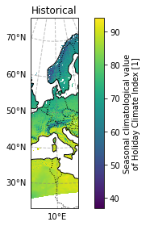
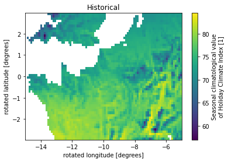
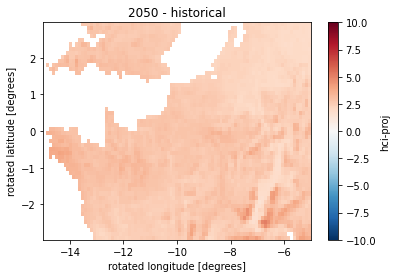

# How to handle CDS Tourism data
## An example use-case for the Dutch province Zuid-Holland

In this notebook we will showcase how data from the Copernicus Climate DataStore can be used. 

We first import some packages


```python
##import packages
import os
import xarray as xr
import numpy as np
import matplotlib.pyplot as plt
import cartopy
import cartopy.crs as ccrs
```

And then download data from CDS. 
Here we choose:
- Index: Both Urban and Beach tourism.
- Variable: Daily (the only option for seasons).
- Time aggregation: summer.
- Scenario: RCP8.5
- Time horizon: 2050

## The Holiday Climate Index (HCI) for *Urban tourism* 

We first look at urban tourism, then beach tourism below. 

### Download data
The below code retrieves the data for our selection. Note that you need to set up the API for CDS, see more [here](https://cds.climate.copernicus.eu/api-how-to) on how to do so.


```python
# import cdsapi

# c = cdsapi.Client()

# c.retrieve(
#     'sis-tourism-climate-suitability-indicators',
#     {
#         'climate_index': 'climate_index_for_tourism',
#         'variable': 'daily_index',
#         'product_type': 'multi_model_mean',
#         'time_aggregation': [
#             'autumn', 'spring', 'summer',
#             'winter',
#         ],
#         'experiment': 'rcp8_5',
#         'period': '2041_2060',
#         'format': 'zip',
#     },
#     './Data/download.zip')
```

And we retrieve the historical data for comparison


```python
# c = cdsapi.Client()

# c.retrieve(
#     'sis-tourism-climate-suitability-indicators',
#     {
#         'climate_index': 'holiday_climate_index',
#         'variable': 'daily_index',
#         'product_type': 'multi_model_mean',
#         'time_aggregation': [
#             'autumn', 'spring', 'summer',
#             'winter',
#         ],
#         'experiment': 'historical',
#         'period': '1986_2005',
#         'format': 'zip',
#     },
#     './Data/download_historical.zip')
```

### Load data

The data is downloaded as a zip file in the 'Data' directory. I manually unzipped it and sorted it in a 'Urban_HCI/Historical' and 'Urban_HCI/RCP85_2050' directory within the 'Data' directory. Now lets load the data:


```python
HCI_jja_hist = xr.open_dataset('./Data/Urban_HCI/Historical/C3S422Lot2TEC_hci-proj_mean_jja_1986_2005_v1.nc')
```


```python
HCI_jja_proj = xr.open_dataset('./Data/Urban_HCI/RCP85_2050/C3S422Lot2TEC_hci-proj_mean_jja_2041_2060_v1.nc')
```

Lets have a look at the xarray dataset for future projections:


```python
HCI_jja_proj
```


<div><svg style="position: absolute; width: 0; height: 0; overflow: hidden">
<defs>
<symbol id="icon-database" viewBox="0 0 32 32">
<path d="M16 0c-8.837 0-16 2.239-16 5v4c0 2.761 7.163 5 16 5s16-2.239 16-5v-4c0-2.761-7.163-5-16-5z"></path>
<path d="M16 17c-8.837 0-16-2.239-16-5v6c0 2.761 7.163 5 16 5s16-2.239 16-5v-6c0 2.761-7.163 5-16 5z"></path>
<path d="M16 26c-8.837 0-16-2.239-16-5v6c0 2.761 7.163 5 16 5s16-2.239 16-5v-6c0 2.761-7.163 5-16 5z"></path>
</symbol>
<symbol id="icon-file-text2" viewBox="0 0 32 32">
<path d="M28.681 7.159c-0.694-0.947-1.662-2.053-2.724-3.116s-2.169-2.030-3.116-2.724c-1.612-1.182-2.393-1.319-2.841-1.319h-15.5c-1.378 0-2.5 1.121-2.5 2.5v27c0 1.378 1.122 2.5 2.5 2.5h23c1.378 0 2.5-1.122 2.5-2.5v-19.5c0-0.448-0.137-1.23-1.319-2.841zM24.543 5.457c0.959 0.959 1.712 1.825 2.268 2.543h-4.811v-4.811c0.718 0.556 1.584 1.309 2.543 2.268zM28 29.5c0 0.271-0.229 0.5-0.5 0.5h-23c-0.271 0-0.5-0.229-0.5-0.5v-27c0-0.271 0.229-0.5 0.5-0.5 0 0 15.499-0 15.5 0v7c0 0.552 0.448 1 1 1h7v19.5z"></path>
<path d="M23 26h-14c-0.552 0-1-0.448-1-1s0.448-1 1-1h14c0.552 0 1 0.448 1 1s-0.448 1-1 1z"></path>
<path d="M23 22h-14c-0.552 0-1-0.448-1-1s0.448-1 1-1h14c0.552 0 1 0.448 1 1s-0.448 1-1 1z"></path>
<path d="M23 18h-14c-0.552 0-1-0.448-1-1s0.448-1 1-1h14c0.552 0 1 0.448 1 1s-0.448 1-1 1z"></path>
</symbol>
</defs>
</svg>
<style>/* CSS stylesheet for displaying xarray objects in jupyterlab.
 *
 */

:root {
  --xr-font-color0: var(--jp-content-font-color0, rgba(0, 0, 0, 1));
  --xr-font-color2: var(--jp-content-font-color2, rgba(0, 0, 0, 0.54));
  --xr-font-color3: var(--jp-content-font-color3, rgba(0, 0, 0, 0.38));
  --xr-border-color: var(--jp-border-color2, #e0e0e0);
  --xr-disabled-color: var(--jp-layout-color3, #bdbdbd);
  --xr-background-color: var(--jp-layout-color0, white);
  --xr-background-color-row-even: var(--jp-layout-color1, white);
  --xr-background-color-row-odd: var(--jp-layout-color2, #eeeeee);
}

html[theme=dark],
body.vscode-dark {
  --xr-font-color0: rgba(255, 255, 255, 1);
  --xr-font-color2: rgba(255, 255, 255, 0.54);
  --xr-font-color3: rgba(255, 255, 255, 0.38);
  --xr-border-color: #1F1F1F;
  --xr-disabled-color: #515151;
  --xr-background-color: #111111;
  --xr-background-color-row-even: #111111;
  --xr-background-color-row-odd: #313131;
}

.xr-wrap {
  display: block !important;
  min-width: 300px;
  max-width: 700px;
}

.xr-text-repr-fallback {
  /* fallback to plain text repr when CSS is not injected (untrusted notebook) */
  display: none;
}

.xr-header {
  padding-top: 6px;
  padding-bottom: 6px;
  margin-bottom: 4px;
  border-bottom: solid 1px var(--xr-border-color);
}

.xr-header > div,
.xr-header > ul {
  display: inline;
  margin-top: 0;
  margin-bottom: 0;
}

.xr-obj-type,
.xr-array-name {
  margin-left: 2px;
  margin-right: 10px;
}

.xr-obj-type {
  color: var(--xr-font-color2);
}

.xr-sections {
  padding-left: 0 !important;
  display: grid;
  grid-template-columns: 150px auto auto 1fr 20px 20px;
}

.xr-section-item {
  display: contents;
}

.xr-section-item input {
  display: none;
}

.xr-section-item input + label {
  color: var(--xr-disabled-color);
}

.xr-section-item input:enabled + label {
  cursor: pointer;
  color: var(--xr-font-color2);
}

.xr-section-item input:enabled + label:hover {
  color: var(--xr-font-color0);
}

.xr-section-summary {
  grid-column: 1;
  color: var(--xr-font-color2);
  font-weight: 500;
}

.xr-section-summary > span {
  display: inline-block;
  padding-left: 0.5em;
}

.xr-section-summary-in:disabled + label {
  color: var(--xr-font-color2);
}

.xr-section-summary-in + label:before {
  display: inline-block;
  content: '►';
  font-size: 11px;
  width: 15px;
  text-align: center;
}

.xr-section-summary-in:disabled + label:before {
  color: var(--xr-disabled-color);
}

.xr-section-summary-in:checked + label:before {
  content: '▼';
}

.xr-section-summary-in:checked + label > span {
  display: none;
}

.xr-section-summary,
.xr-section-inline-details {
  padding-top: 4px;
  padding-bottom: 4px;
}

.xr-section-inline-details {
  grid-column: 2 / -1;
}

.xr-section-details {
  display: none;
  grid-column: 1 / -1;
  margin-bottom: 5px;
}

.xr-section-summary-in:checked ~ .xr-section-details {
  display: contents;
}

.xr-array-wrap {
  grid-column: 1 / -1;
  display: grid;
  grid-template-columns: 20px auto;
}

.xr-array-wrap > label {
  grid-column: 1;
  vertical-align: top;
}

.xr-preview {
  color: var(--xr-font-color3);
}

.xr-array-preview,
.xr-array-data {
  padding: 0 5px !important;
  grid-column: 2;
}

.xr-array-data,
.xr-array-in:checked ~ .xr-array-preview {
  display: none;
}

.xr-array-in:checked ~ .xr-array-data,
.xr-array-preview {
  display: inline-block;
}

.xr-dim-list {
  display: inline-block !important;
  list-style: none;
  padding: 0 !important;
  margin: 0;
}

.xr-dim-list li {
  display: inline-block;
  padding: 0;
  margin: 0;
}

.xr-dim-list:before {
  content: '(';
}

.xr-dim-list:after {
  content: ')';
}

.xr-dim-list li:not(:last-child):after {
  content: ',';
  padding-right: 5px;
}

.xr-has-index {
  font-weight: bold;
}

.xr-var-list,
.xr-var-item {
  display: contents;
}

.xr-var-item > div,
.xr-var-item label,
.xr-var-item > .xr-var-name span {
  background-color: var(--xr-background-color-row-even);
  margin-bottom: 0;
}

.xr-var-item > .xr-var-name:hover span {
  padding-right: 5px;
}

.xr-var-list > li:nth-child(odd) > div,
.xr-var-list > li:nth-child(odd) > label,
.xr-var-list > li:nth-child(odd) > .xr-var-name span {
  background-color: var(--xr-background-color-row-odd);
}

.xr-var-name {
  grid-column: 1;
}

.xr-var-dims {
  grid-column: 2;
}

.xr-var-dtype {
  grid-column: 3;
  text-align: right;
  color: var(--xr-font-color2);
}

.xr-var-preview {
  grid-column: 4;
}

.xr-var-name,
.xr-var-dims,
.xr-var-dtype,
.xr-preview,
.xr-attrs dt {
  white-space: nowrap;
  overflow: hidden;
  text-overflow: ellipsis;
  padding-right: 10px;
}

.xr-var-name:hover,
.xr-var-dims:hover,
.xr-var-dtype:hover,
.xr-attrs dt:hover {
  overflow: visible;
  width: auto;
  z-index: 1;
}

.xr-var-attrs,
.xr-var-data {
  display: none;
  background-color: var(--xr-background-color) !important;
  padding-bottom: 5px !important;
}

.xr-var-attrs-in:checked ~ .xr-var-attrs,
.xr-var-data-in:checked ~ .xr-var-data {
  display: block;
}

.xr-var-data > table {
  float: right;
}

.xr-var-name span,
.xr-var-data,
.xr-attrs {
  padding-left: 25px !important;
}

.xr-attrs,
.xr-var-attrs,
.xr-var-data {
  grid-column: 1 / -1;
}

dl.xr-attrs {
  padding: 0;
  margin: 0;
  display: grid;
  grid-template-columns: 125px auto;
}

.xr-attrs dt,
.xr-attrs dd {
  padding: 0;
  margin: 0;
  float: left;
  padding-right: 10px;
  width: auto;
}

.xr-attrs dt {
  font-weight: normal;
  grid-column: 1;
}

.xr-attrs dt:hover span {
  display: inline-block;
  background: var(--xr-background-color);
  padding-right: 10px;
}

.xr-attrs dd {
  grid-column: 2;
  white-space: pre-wrap;
  word-break: break-all;
}

.xr-icon-database,
.xr-icon-file-text2 {
  display: inline-block;
  vertical-align: middle;
  width: 1em;
  height: 1.5em !important;
  stroke-width: 0;
  stroke: currentColor;
  fill: currentColor;
}
</style><pre class='xr-text-repr-fallback'>&lt;xarray.Dataset&gt;
Dimensions:             (rlat: 412, rlon: 424, time: 1, bnds: 2)
Coordinates:
  * rlat                (rlat) float64 -23.38 -23.27 -23.16 ... 21.73 21.84
  * rlon                (rlon) float64 -28.38 -28.27 -28.16 ... 18.05 18.16
  * time                (time) object 2050-07-15 00:00:00
    lon                 (rlat, rlon) float64 ...
    lat                 (rlat, rlon) float64 ...
Dimensions without coordinates: bnds
Data variables:
    hci-proj            (time, rlat, rlon) float64 ...
    rotated_pole        |S1 b&#x27;&#x27;
    climatology_bounds  (time, bnds) object 2041-06-01 00:00:00 2060-09-01 00...
Attributes: (12/14)
    Conventions:    CF-1.7
    title:          Holiday Climate Index (HCI) scenario seasonal climatology...
    references:     Scott et al. 2016, https://doi.org/10.3390/atmos7060080
    source:         Processing of ECVs from EURO-CORDEX climate projections
    institution:    CMCC, Centro Euro-Mediterraneo sui Cambiamenti Climatici,...
    contact:        http://copernicus-support.ecmwf.int
    ...             ...
    comment:        Ensemble mean over selected EURO-CORDEX projections of JJ...
    history:        
    lineage:        
    summary:        HCI projection data produced by CMCC as its contribution ...
    keywords:       Holiday Climate Index, Climate Projections, C3S, Euro-Cor...
    license:        </pre><div class='xr-wrap' style='display:none'><div class='xr-header'><div class='xr-obj-type'>xarray.Dataset</div></div><ul class='xr-sections'><li class='xr-section-item'><input id='section-c3d75532-e760-4337-86ae-b1873f89dfb9' class='xr-section-summary-in' type='checkbox' disabled ><label for='section-c3d75532-e760-4337-86ae-b1873f89dfb9' class='xr-section-summary'  title='Expand/collapse section'>Dimensions:</label><div class='xr-section-inline-details'><ul class='xr-dim-list'><li><span class='xr-has-index'>rlat</span>: 412</li><li><span class='xr-has-index'>rlon</span>: 424</li><li><span class='xr-has-index'>time</span>: 1</li><li><span>bnds</span>: 2</li></ul></div><div class='xr-section-details'></div></li><li class='xr-section-item'><input id='section-58af0184-f7b9-401d-84b3-dc4457a15f44' class='xr-section-summary-in' type='checkbox'  checked><label for='section-58af0184-f7b9-401d-84b3-dc4457a15f44' class='xr-section-summary' >Coordinates: <span>(5)</span></label><div class='xr-section-inline-details'></div><div class='xr-section-details'><ul class='xr-var-list'><li class='xr-var-item'><div class='xr-var-name'><span class='xr-has-index'>rlat</span></div><div class='xr-var-dims'>(rlat)</div><div class='xr-var-dtype'>float64</div><div class='xr-var-preview xr-preview'>-23.38 -23.27 ... 21.73 21.84</div><input id='attrs-369b30f4-8932-4037-808b-850f3b554543' class='xr-var-attrs-in' type='checkbox' ><label for='attrs-369b30f4-8932-4037-808b-850f3b554543' title='Show/Hide attributes'><svg class='icon xr-icon-file-text2'><use xlink:href='#icon-file-text2'></use></svg></label><input id='data-546f5ebc-1fb8-44d1-9ad9-8fbf8e085834' class='xr-var-data-in' type='checkbox'><label for='data-546f5ebc-1fb8-44d1-9ad9-8fbf8e085834' title='Show/Hide data repr'><svg class='icon xr-icon-database'><use xlink:href='#icon-database'></use></svg></label><div class='xr-var-attrs'><dl class='xr-attrs'><dt><span>units :</span></dt><dd>degrees</dd><dt><span>long_name :</span></dt><dd>rotated latitude</dd><dt><span>axis :</span></dt><dd>Y</dd><dt><span>standard_name :</span></dt><dd>grid_latitude</dd><dt><span>_CoordinateAxisType :</span></dt><dd>GeoY</dd></dl></div><div class='xr-var-data'><pre>array([-23.375, -23.265, -23.155, ...,  21.615,  21.725,  21.835])</pre></div></li><li class='xr-var-item'><div class='xr-var-name'><span class='xr-has-index'>rlon</span></div><div class='xr-var-dims'>(rlon)</div><div class='xr-var-dtype'>float64</div><div class='xr-var-preview xr-preview'>-28.38 -28.27 ... 18.05 18.16</div><input id='attrs-12201681-b4e0-4ae1-b43d-260e040ddcb0' class='xr-var-attrs-in' type='checkbox' ><label for='attrs-12201681-b4e0-4ae1-b43d-260e040ddcb0' title='Show/Hide attributes'><svg class='icon xr-icon-file-text2'><use xlink:href='#icon-file-text2'></use></svg></label><input id='data-20419f64-98fa-4446-92b6-6bce969ce60a' class='xr-var-data-in' type='checkbox'><label for='data-20419f64-98fa-4446-92b6-6bce969ce60a' title='Show/Hide data repr'><svg class='icon xr-icon-database'><use xlink:href='#icon-database'></use></svg></label><div class='xr-var-attrs'><dl class='xr-attrs'><dt><span>units :</span></dt><dd>degrees</dd><dt><span>long_name :</span></dt><dd>rotated longitude</dd><dt><span>axis :</span></dt><dd>X</dd><dt><span>standard_name :</span></dt><dd>grid_longitude</dd><dt><span>_CoordinateAxisType :</span></dt><dd>GeoX</dd></dl></div><div class='xr-var-data'><pre>array([-28.375, -28.265, -28.155, ...,  17.935,  18.045,  18.155])</pre></div></li><li class='xr-var-item'><div class='xr-var-name'><span class='xr-has-index'>time</span></div><div class='xr-var-dims'>(time)</div><div class='xr-var-dtype'>object</div><div class='xr-var-preview xr-preview'>2050-07-15 00:00:00</div><input id='attrs-01bacc04-a3f0-4ee2-b60d-0ed5ee7b5545' class='xr-var-attrs-in' type='checkbox' ><label for='attrs-01bacc04-a3f0-4ee2-b60d-0ed5ee7b5545' title='Show/Hide attributes'><svg class='icon xr-icon-file-text2'><use xlink:href='#icon-file-text2'></use></svg></label><input id='data-e29ab149-a7ac-4d35-9bb9-261a975ff29b' class='xr-var-data-in' type='checkbox'><label for='data-e29ab149-a7ac-4d35-9bb9-261a975ff29b' title='Show/Hide data repr'><svg class='icon xr-icon-database'><use xlink:href='#icon-database'></use></svg></label><div class='xr-var-attrs'><dl class='xr-attrs'><dt><span>long_name :</span></dt><dd>time</dd><dt><span>standard_name :</span></dt><dd>time</dd><dt><span>climatology :</span></dt><dd>climatology_bounds</dd><dt><span>axis :</span></dt><dd>T</dd></dl></div><div class='xr-var-data'><pre>array([cftime.DatetimeNoLeap(2050, 7, 15, 0, 0, 0, 0, has_year_zero=True)],
      dtype=object)</pre></div></li><li class='xr-var-item'><div class='xr-var-name'><span>lon</span></div><div class='xr-var-dims'>(rlat, rlon)</div><div class='xr-var-dtype'>float64</div><div class='xr-var-preview xr-preview'>...</div><input id='attrs-f5a94d07-4352-42e2-b0ab-e8b065ec3b17' class='xr-var-attrs-in' type='checkbox' ><label for='attrs-f5a94d07-4352-42e2-b0ab-e8b065ec3b17' title='Show/Hide attributes'><svg class='icon xr-icon-file-text2'><use xlink:href='#icon-file-text2'></use></svg></label><input id='data-ac1a526d-a7b3-4f4e-900e-8ffdbc3097c0' class='xr-var-data-in' type='checkbox'><label for='data-ac1a526d-a7b3-4f4e-900e-8ffdbc3097c0' title='Show/Hide data repr'><svg class='icon xr-icon-database'><use xlink:href='#icon-database'></use></svg></label><div class='xr-var-attrs'><dl class='xr-attrs'><dt><span>units :</span></dt><dd>degrees_east</dd><dt><span>long_name :</span></dt><dd>longitude</dd><dt><span>standard_name :</span></dt><dd>longitude</dd></dl></div><div class='xr-var-data'><pre>[174688 values with dtype=float64]</pre></div></li><li class='xr-var-item'><div class='xr-var-name'><span>lat</span></div><div class='xr-var-dims'>(rlat, rlon)</div><div class='xr-var-dtype'>float64</div><div class='xr-var-preview xr-preview'>...</div><input id='attrs-2050ece4-3b5e-43e5-921b-4d272673af7c' class='xr-var-attrs-in' type='checkbox' ><label for='attrs-2050ece4-3b5e-43e5-921b-4d272673af7c' title='Show/Hide attributes'><svg class='icon xr-icon-file-text2'><use xlink:href='#icon-file-text2'></use></svg></label><input id='data-be0239a7-5caa-4e24-9e72-c41b7fe5c394' class='xr-var-data-in' type='checkbox'><label for='data-be0239a7-5caa-4e24-9e72-c41b7fe5c394' title='Show/Hide data repr'><svg class='icon xr-icon-database'><use xlink:href='#icon-database'></use></svg></label><div class='xr-var-attrs'><dl class='xr-attrs'><dt><span>units :</span></dt><dd>degrees_north</dd><dt><span>long_name :</span></dt><dd>latitude</dd><dt><span>standard_name :</span></dt><dd>latitude</dd></dl></div><div class='xr-var-data'><pre>[174688 values with dtype=float64]</pre></div></li></ul></div></li><li class='xr-section-item'><input id='section-c1b50884-5720-4d0b-99e6-c4d3f12054e9' class='xr-section-summary-in' type='checkbox'  checked><label for='section-c1b50884-5720-4d0b-99e6-c4d3f12054e9' class='xr-section-summary' >Data variables: <span>(3)</span></label><div class='xr-section-inline-details'></div><div class='xr-section-details'><ul class='xr-var-list'><li class='xr-var-item'><div class='xr-var-name'><span>hci-proj</span></div><div class='xr-var-dims'>(time, rlat, rlon)</div><div class='xr-var-dtype'>float64</div><div class='xr-var-preview xr-preview'>...</div><input id='attrs-fd9fb7b9-1fa9-434e-9864-e016244d834d' class='xr-var-attrs-in' type='checkbox' ><label for='attrs-fd9fb7b9-1fa9-434e-9864-e016244d834d' title='Show/Hide attributes'><svg class='icon xr-icon-file-text2'><use xlink:href='#icon-file-text2'></use></svg></label><input id='data-c3005e6c-24f9-473a-acfc-b3525aeb55ca' class='xr-var-data-in' type='checkbox'><label for='data-c3005e6c-24f9-473a-acfc-b3525aeb55ca' title='Show/Hide data repr'><svg class='icon xr-icon-database'><use xlink:href='#icon-database'></use></svg></label><div class='xr-var-attrs'><dl class='xr-attrs'><dt><span>units :</span></dt><dd>1</dd><dt><span>long_name :</span></dt><dd>Seasonal climatological value of Holiday Climate Index</dd><dt><span>short_name :</span></dt><dd>hci-proj</dd><dt><span>standard_name :</span></dt><dd>hci-proj</dd><dt><span>cell_methods :</span></dt><dd>time: mean within years time: mean over years</dd><dt><span>grid_mapping :</span></dt><dd>rotated_latitude_longitude</dd></dl></div><div class='xr-var-data'><pre>[174688 values with dtype=float64]</pre></div></li><li class='xr-var-item'><div class='xr-var-name'><span>rotated_pole</span></div><div class='xr-var-dims'>()</div><div class='xr-var-dtype'>|S1</div><div class='xr-var-preview xr-preview'>...</div><input id='attrs-48593795-3e85-4bb3-8aca-32e02cb0979f' class='xr-var-attrs-in' type='checkbox' ><label for='attrs-48593795-3e85-4bb3-8aca-32e02cb0979f' title='Show/Hide attributes'><svg class='icon xr-icon-file-text2'><use xlink:href='#icon-file-text2'></use></svg></label><input id='data-e9d5f678-cdcd-4039-a808-11dc2c725640' class='xr-var-data-in' type='checkbox'><label for='data-e9d5f678-cdcd-4039-a808-11dc2c725640' title='Show/Hide data repr'><svg class='icon xr-icon-database'><use xlink:href='#icon-database'></use></svg></label><div class='xr-var-attrs'><dl class='xr-attrs'><dt><span>grid_mapping_name :</span></dt><dd>rotated_latitude_longitude</dd><dt><span>grid_north_pole_latitude :</span></dt><dd>39.25</dd><dt><span>grid_north_pole_longitude :</span></dt><dd>-162.0</dd><dt><span>_CoordinateTransformType :</span></dt><dd>Projection</dd><dt><span>_CoordinateAxisTypes :</span></dt><dd>GeoX GeoY</dd></dl></div><div class='xr-var-data'><pre>array(b&#x27;&#x27;, dtype=&#x27;|S1&#x27;)</pre></div></li><li class='xr-var-item'><div class='xr-var-name'><span>climatology_bounds</span></div><div class='xr-var-dims'>(time, bnds)</div><div class='xr-var-dtype'>object</div><div class='xr-var-preview xr-preview'>...</div><input id='attrs-96721454-d711-4e67-a95d-4bf2a9599ed8' class='xr-var-attrs-in' type='checkbox' ><label for='attrs-96721454-d711-4e67-a95d-4bf2a9599ed8' title='Show/Hide attributes'><svg class='icon xr-icon-file-text2'><use xlink:href='#icon-file-text2'></use></svg></label><input id='data-91f314d8-eb73-4c72-b801-ed483e248bfa' class='xr-var-data-in' type='checkbox'><label for='data-91f314d8-eb73-4c72-b801-ed483e248bfa' title='Show/Hide data repr'><svg class='icon xr-icon-database'><use xlink:href='#icon-database'></use></svg></label><div class='xr-var-attrs'><dl class='xr-attrs'><dt><span>cell_methods :</span></dt><dd>time: mean within years time: mean over years</dd></dl></div><div class='xr-var-data'><pre>array([[cftime.DatetimeNoLeap(2041, 6, 1, 0, 0, 0, 0, has_year_zero=True),
        cftime.DatetimeNoLeap(2060, 9, 1, 0, 0, 0, 0, has_year_zero=True)]],
      dtype=object)</pre></div></li></ul></div></li><li class='xr-section-item'><input id='section-aad91f0f-f078-4d5e-9c90-6feafe694f23' class='xr-section-summary-in' type='checkbox'  ><label for='section-aad91f0f-f078-4d5e-9c90-6feafe694f23' class='xr-section-summary' >Attributes: <span>(14)</span></label><div class='xr-section-inline-details'></div><div class='xr-section-details'><dl class='xr-attrs'><dt><span>Conventions :</span></dt><dd>CF-1.7</dd><dt><span>title :</span></dt><dd>Holiday Climate Index (HCI) scenario seasonal climatology for C3S European Tourism</dd><dt><span>references :</span></dt><dd>Scott et al. 2016, https://doi.org/10.3390/atmos7060080</dd><dt><span>source :</span></dt><dd>Processing of ECVs from EURO-CORDEX climate projections</dd><dt><span>institution :</span></dt><dd>CMCC, Centro Euro-Mediterraneo sui Cambiamenti Climatici, Bologna, Italy</dd><dt><span>contact :</span></dt><dd>http://copernicus-support.ecmwf.int</dd><dt><span>project :</span></dt><dd>C3S European Tourism (C3S_422_Lot2_TEC)</dd><dt><span>creation_date :</span></dt><dd>Thu Aug 29 14:49:51 2019</dd><dt><span>comment :</span></dt><dd>Ensemble mean over selected EURO-CORDEX projections of JJA climatologies computed for the RCP85 scenario (2041-2060)</dd><dt><span>history :</span></dt><dd></dd><dt><span>lineage :</span></dt><dd></dd><dt><span>summary :</span></dt><dd>HCI projection data produced by CMCC as its contribution to the C3S European Tourism project. The data cover the Euro-CORDEX domain with a 0.11 degree horizontal resolution and spans both historical and scenario periods&quot; ;</dd><dt><span>keywords :</span></dt><dd>Holiday Climate Index, Climate Projections, C3S, Euro-Cordex, Copernicus, Climate Change, Sectoral Climate Impact Indicators</dd><dt><span>license :</span></dt><dd></dd></dl></div></li></ul></div></div>


### Making the maps
With the data loaded, we can now make some plots of the data! Read more about plotting with xarray [here](https://docs.xarray.dev/en/stable/user-guide/plotting.html#two-dimensions).

#### Historical and future projections of the holiday climate index for urban tourism


```python
HCI_jja_hist['hci-proj'].plot()
plt.title('Historical')
plt.savefig('./Graphs/HCI_jja_hist.png')
```


    

    


```python
HCI_jja_proj['hci-proj'].plot()
plt.title('2050')
plt.savefig('./Graphs/HCI_jja_RCP85_2050.png')
```


    

    


#### Trend in the holiday climate index for urban tourism
I now calculate the difference between the projection and historical data. Note that I need to load the data in memory first before doing the calculation and I need to drop the time dimension. 


```python
HCI_jja_hist.load()
HCI_jja_proj.load()
HCI_proj_min_hist = (HCI_jja_proj['hci-proj'].drop('time')-HCI_jja_hist['hci-proj'].drop('time'))
```


```python
HCI_proj_min_hist.plot()
plt.title('2050 - historical')
plt.savefig('./Graphs/HCI_jja_change.png')
```


    

    


#### More advanced plotting and Zooming in on Zuid-Holland
We want to zoom in on Zuid-Holland. The data has this odd 'rotated' latitude and longitude, such that the original values for Zuid Holland (~52, ~4.5) don't translate. Therefore I am setting up a new projection and transform the rotated pole onto it. 

<!-- I `slice` the values to make a new zoomed-in plot. For this new plot I want to keep the colorbar values and colors.  -->


```python
HCI_jja_hist['hci-proj']
```


<div><svg style="position: absolute; width: 0; height: 0; overflow: hidden">
<defs>
<symbol id="icon-database" viewBox="0 0 32 32">
<path d="M16 0c-8.837 0-16 2.239-16 5v4c0 2.761 7.163 5 16 5s16-2.239 16-5v-4c0-2.761-7.163-5-16-5z"></path>
<path d="M16 17c-8.837 0-16-2.239-16-5v6c0 2.761 7.163 5 16 5s16-2.239 16-5v-6c0 2.761-7.163 5-16 5z"></path>
<path d="M16 26c-8.837 0-16-2.239-16-5v6c0 2.761 7.163 5 16 5s16-2.239 16-5v-6c0 2.761-7.163 5-16 5z"></path>
</symbol>
<symbol id="icon-file-text2" viewBox="0 0 32 32">
<path d="M28.681 7.159c-0.694-0.947-1.662-2.053-2.724-3.116s-2.169-2.030-3.116-2.724c-1.612-1.182-2.393-1.319-2.841-1.319h-15.5c-1.378 0-2.5 1.121-2.5 2.5v27c0 1.378 1.122 2.5 2.5 2.5h23c1.378 0 2.5-1.122 2.5-2.5v-19.5c0-0.448-0.137-1.23-1.319-2.841zM24.543 5.457c0.959 0.959 1.712 1.825 2.268 2.543h-4.811v-4.811c0.718 0.556 1.584 1.309 2.543 2.268zM28 29.5c0 0.271-0.229 0.5-0.5 0.5h-23c-0.271 0-0.5-0.229-0.5-0.5v-27c0-0.271 0.229-0.5 0.5-0.5 0 0 15.499-0 15.5 0v7c0 0.552 0.448 1 1 1h7v19.5z"></path>
<path d="M23 26h-14c-0.552 0-1-0.448-1-1s0.448-1 1-1h14c0.552 0 1 0.448 1 1s-0.448 1-1 1z"></path>
<path d="M23 22h-14c-0.552 0-1-0.448-1-1s0.448-1 1-1h14c0.552 0 1 0.448 1 1s-0.448 1-1 1z"></path>
<path d="M23 18h-14c-0.552 0-1-0.448-1-1s0.448-1 1-1h14c0.552 0 1 0.448 1 1s-0.448 1-1 1z"></path>
</symbol>
</defs>
</svg>
<style>/* CSS stylesheet for displaying xarray objects in jupyterlab.
 *
 */

:root {
  --xr-font-color0: var(--jp-content-font-color0, rgba(0, 0, 0, 1));
  --xr-font-color2: var(--jp-content-font-color2, rgba(0, 0, 0, 0.54));
  --xr-font-color3: var(--jp-content-font-color3, rgba(0, 0, 0, 0.38));
  --xr-border-color: var(--jp-border-color2, #e0e0e0);
  --xr-disabled-color: var(--jp-layout-color3, #bdbdbd);
  --xr-background-color: var(--jp-layout-color0, white);
  --xr-background-color-row-even: var(--jp-layout-color1, white);
  --xr-background-color-row-odd: var(--jp-layout-color2, #eeeeee);
}

html[theme=dark],
body.vscode-dark {
  --xr-font-color0: rgba(255, 255, 255, 1);
  --xr-font-color2: rgba(255, 255, 255, 0.54);
  --xr-font-color3: rgba(255, 255, 255, 0.38);
  --xr-border-color: #1F1F1F;
  --xr-disabled-color: #515151;
  --xr-background-color: #111111;
  --xr-background-color-row-even: #111111;
  --xr-background-color-row-odd: #313131;
}

.xr-wrap {
  display: block !important;
  min-width: 300px;
  max-width: 700px;
}

.xr-text-repr-fallback {
  /* fallback to plain text repr when CSS is not injected (untrusted notebook) */
  display: none;
}

.xr-header {
  padding-top: 6px;
  padding-bottom: 6px;
  margin-bottom: 4px;
  border-bottom: solid 1px var(--xr-border-color);
}

.xr-header > div,
.xr-header > ul {
  display: inline;
  margin-top: 0;
  margin-bottom: 0;
}

.xr-obj-type,
.xr-array-name {
  margin-left: 2px;
  margin-right: 10px;
}

.xr-obj-type {
  color: var(--xr-font-color2);
}

.xr-sections {
  padding-left: 0 !important;
  display: grid;
  grid-template-columns: 150px auto auto 1fr 20px 20px;
}

.xr-section-item {
  display: contents;
}

.xr-section-item input {
  display: none;
}

.xr-section-item input + label {
  color: var(--xr-disabled-color);
}

.xr-section-item input:enabled + label {
  cursor: pointer;
  color: var(--xr-font-color2);
}

.xr-section-item input:enabled + label:hover {
  color: var(--xr-font-color0);
}

.xr-section-summary {
  grid-column: 1;
  color: var(--xr-font-color2);
  font-weight: 500;
}

.xr-section-summary > span {
  display: inline-block;
  padding-left: 0.5em;
}

.xr-section-summary-in:disabled + label {
  color: var(--xr-font-color2);
}

.xr-section-summary-in + label:before {
  display: inline-block;
  content: '►';
  font-size: 11px;
  width: 15px;
  text-align: center;
}

.xr-section-summary-in:disabled + label:before {
  color: var(--xr-disabled-color);
}

.xr-section-summary-in:checked + label:before {
  content: '▼';
}

.xr-section-summary-in:checked + label > span {
  display: none;
}

.xr-section-summary,
.xr-section-inline-details {
  padding-top: 4px;
  padding-bottom: 4px;
}

.xr-section-inline-details {
  grid-column: 2 / -1;
}

.xr-section-details {
  display: none;
  grid-column: 1 / -1;
  margin-bottom: 5px;
}

.xr-section-summary-in:checked ~ .xr-section-details {
  display: contents;
}

.xr-array-wrap {
  grid-column: 1 / -1;
  display: grid;
  grid-template-columns: 20px auto;
}

.xr-array-wrap > label {
  grid-column: 1;
  vertical-align: top;
}

.xr-preview {
  color: var(--xr-font-color3);
}

.xr-array-preview,
.xr-array-data {
  padding: 0 5px !important;
  grid-column: 2;
}

.xr-array-data,
.xr-array-in:checked ~ .xr-array-preview {
  display: none;
}

.xr-array-in:checked ~ .xr-array-data,
.xr-array-preview {
  display: inline-block;
}

.xr-dim-list {
  display: inline-block !important;
  list-style: none;
  padding: 0 !important;
  margin: 0;
}

.xr-dim-list li {
  display: inline-block;
  padding: 0;
  margin: 0;
}

.xr-dim-list:before {
  content: '(';
}

.xr-dim-list:after {
  content: ')';
}

.xr-dim-list li:not(:last-child):after {
  content: ',';
  padding-right: 5px;
}

.xr-has-index {
  font-weight: bold;
}

.xr-var-list,
.xr-var-item {
  display: contents;
}

.xr-var-item > div,
.xr-var-item label,
.xr-var-item > .xr-var-name span {
  background-color: var(--xr-background-color-row-even);
  margin-bottom: 0;
}

.xr-var-item > .xr-var-name:hover span {
  padding-right: 5px;
}

.xr-var-list > li:nth-child(odd) > div,
.xr-var-list > li:nth-child(odd) > label,
.xr-var-list > li:nth-child(odd) > .xr-var-name span {
  background-color: var(--xr-background-color-row-odd);
}

.xr-var-name {
  grid-column: 1;
}

.xr-var-dims {
  grid-column: 2;
}

.xr-var-dtype {
  grid-column: 3;
  text-align: right;
  color: var(--xr-font-color2);
}

.xr-var-preview {
  grid-column: 4;
}

.xr-var-name,
.xr-var-dims,
.xr-var-dtype,
.xr-preview,
.xr-attrs dt {
  white-space: nowrap;
  overflow: hidden;
  text-overflow: ellipsis;
  padding-right: 10px;
}

.xr-var-name:hover,
.xr-var-dims:hover,
.xr-var-dtype:hover,
.xr-attrs dt:hover {
  overflow: visible;
  width: auto;
  z-index: 1;
}

.xr-var-attrs,
.xr-var-data {
  display: none;
  background-color: var(--xr-background-color) !important;
  padding-bottom: 5px !important;
}

.xr-var-attrs-in:checked ~ .xr-var-attrs,
.xr-var-data-in:checked ~ .xr-var-data {
  display: block;
}

.xr-var-data > table {
  float: right;
}

.xr-var-name span,
.xr-var-data,
.xr-attrs {
  padding-left: 25px !important;
}

.xr-attrs,
.xr-var-attrs,
.xr-var-data {
  grid-column: 1 / -1;
}

dl.xr-attrs {
  padding: 0;
  margin: 0;
  display: grid;
  grid-template-columns: 125px auto;
}

.xr-attrs dt,
.xr-attrs dd {
  padding: 0;
  margin: 0;
  float: left;
  padding-right: 10px;
  width: auto;
}

.xr-attrs dt {
  font-weight: normal;
  grid-column: 1;
}

.xr-attrs dt:hover span {
  display: inline-block;
  background: var(--xr-background-color);
  padding-right: 10px;
}

.xr-attrs dd {
  grid-column: 2;
  white-space: pre-wrap;
  word-break: break-all;
}

.xr-icon-database,
.xr-icon-file-text2 {
  display: inline-block;
  vertical-align: middle;
  width: 1em;
  height: 1.5em !important;
  stroke-width: 0;
  stroke: currentColor;
  fill: currentColor;
}
</style><pre class='xr-text-repr-fallback'>&lt;xarray.DataArray &#x27;hci-proj&#x27; (time: 1, rlat: 412, rlon: 424)&gt;
array([[[79.59359319, 79.46800478, 79.35305854, ...,         nan,
                 nan,         nan],
        [80.00642174, 79.93091099, 79.82633214, ...,         nan,
                 nan,         nan],
        [80.32963859, 80.30252091, 80.18039427, ...,         nan,
                 nan,         nan],
        ...,
        [60.19899343, 57.99800179, 57.88522999, ..., 54.15756571,
         61.78139188, 66.27560633],
        [55.69267921, 57.55926523, 60.51545699, ..., 52.33490741,
         55.71616786, 64.28228196],
        [52.74523895, 57.10126045, 61.17103943, ..., 59.91429809,
         58.6217503 , 64.49735962]]])
Coordinates:
  * rlat     (rlat) float64 -23.38 -23.27 -23.16 -23.05 ... 21.62 21.73 21.84
  * rlon     (rlon) float64 -28.38 -28.27 -28.16 -28.05 ... 17.94 18.05 18.16
  * time     (time) object 1995-07-15 00:00:00
    lon      (rlat, rlon) float64 -10.06 -9.964 -9.864 ... 64.55 64.76 64.96
    lat      (rlat, rlon) float64 21.99 22.03 22.07 22.11 ... 66.81 66.75 66.69
Attributes:
    units:          1
    long_name:      Seasonal climatological value of Holiday Climate Index
    short_name:     hci-proj
    standard_name:  hci-proj
    cell_methods:   time: mean within years time: mean over years
    grid_mapping:   rotated_latitude_longitude</pre><div class='xr-wrap' style='display:none'><div class='xr-header'><div class='xr-obj-type'>xarray.DataArray</div><div class='xr-array-name'>'hci-proj'</div><ul class='xr-dim-list'><li><span class='xr-has-index'>time</span>: 1</li><li><span class='xr-has-index'>rlat</span>: 412</li><li><span class='xr-has-index'>rlon</span>: 424</li></ul></div><ul class='xr-sections'><li class='xr-section-item'><div class='xr-array-wrap'><input id='section-a18bf37d-ea78-468d-a17a-a52340ca5c60' class='xr-array-in' type='checkbox' checked><label for='section-a18bf37d-ea78-468d-a17a-a52340ca5c60' title='Show/hide data repr'><svg class='icon xr-icon-database'><use xlink:href='#icon-database'></use></svg></label><div class='xr-array-preview xr-preview'><span>79.59 79.47 79.35 79.23 79.06 78.96 ... 64.29 63.51 59.91 58.62 64.5</span></div><div class='xr-array-data'><pre>array([[[79.59359319, 79.46800478, 79.35305854, ...,         nan,
                 nan,         nan],
        [80.00642174, 79.93091099, 79.82633214, ...,         nan,
                 nan,         nan],
        [80.32963859, 80.30252091, 80.18039427, ...,         nan,
                 nan,         nan],
        ...,
        [60.19899343, 57.99800179, 57.88522999, ..., 54.15756571,
         61.78139188, 66.27560633],
        [55.69267921, 57.55926523, 60.51545699, ..., 52.33490741,
         55.71616786, 64.28228196],
        [52.74523895, 57.10126045, 61.17103943, ..., 59.91429809,
         58.6217503 , 64.49735962]]])</pre></div></div></li><li class='xr-section-item'><input id='section-3ba33726-a41c-466a-996d-14df990c0ab8' class='xr-section-summary-in' type='checkbox'  checked><label for='section-3ba33726-a41c-466a-996d-14df990c0ab8' class='xr-section-summary' >Coordinates: <span>(5)</span></label><div class='xr-section-inline-details'></div><div class='xr-section-details'><ul class='xr-var-list'><li class='xr-var-item'><div class='xr-var-name'><span class='xr-has-index'>rlat</span></div><div class='xr-var-dims'>(rlat)</div><div class='xr-var-dtype'>float64</div><div class='xr-var-preview xr-preview'>-23.38 -23.27 ... 21.73 21.84</div><input id='attrs-784de272-5d07-4a94-8954-88c76f249243' class='xr-var-attrs-in' type='checkbox' ><label for='attrs-784de272-5d07-4a94-8954-88c76f249243' title='Show/Hide attributes'><svg class='icon xr-icon-file-text2'><use xlink:href='#icon-file-text2'></use></svg></label><input id='data-b7341541-6442-4610-9ea8-e4db98e3e6c2' class='xr-var-data-in' type='checkbox'><label for='data-b7341541-6442-4610-9ea8-e4db98e3e6c2' title='Show/Hide data repr'><svg class='icon xr-icon-database'><use xlink:href='#icon-database'></use></svg></label><div class='xr-var-attrs'><dl class='xr-attrs'><dt><span>units :</span></dt><dd>degrees</dd><dt><span>long_name :</span></dt><dd>rotated latitude</dd><dt><span>axis :</span></dt><dd>Y</dd><dt><span>standard_name :</span></dt><dd>grid_latitude</dd><dt><span>_CoordinateAxisType :</span></dt><dd>GeoY</dd></dl></div><div class='xr-var-data'><pre>array([-23.375, -23.265, -23.155, ...,  21.615,  21.725,  21.835])</pre></div></li><li class='xr-var-item'><div class='xr-var-name'><span class='xr-has-index'>rlon</span></div><div class='xr-var-dims'>(rlon)</div><div class='xr-var-dtype'>float64</div><div class='xr-var-preview xr-preview'>-28.38 -28.27 ... 18.05 18.16</div><input id='attrs-0030662b-d1db-4292-b5a2-2463903956fa' class='xr-var-attrs-in' type='checkbox' ><label for='attrs-0030662b-d1db-4292-b5a2-2463903956fa' title='Show/Hide attributes'><svg class='icon xr-icon-file-text2'><use xlink:href='#icon-file-text2'></use></svg></label><input id='data-c8e51cdb-afbf-4e02-9bda-3322ef511562' class='xr-var-data-in' type='checkbox'><label for='data-c8e51cdb-afbf-4e02-9bda-3322ef511562' title='Show/Hide data repr'><svg class='icon xr-icon-database'><use xlink:href='#icon-database'></use></svg></label><div class='xr-var-attrs'><dl class='xr-attrs'><dt><span>units :</span></dt><dd>degrees</dd><dt><span>long_name :</span></dt><dd>rotated longitude</dd><dt><span>axis :</span></dt><dd>X</dd><dt><span>standard_name :</span></dt><dd>grid_longitude</dd><dt><span>_CoordinateAxisType :</span></dt><dd>GeoX</dd></dl></div><div class='xr-var-data'><pre>array([-28.375, -28.265, -28.155, ...,  17.935,  18.045,  18.155])</pre></div></li><li class='xr-var-item'><div class='xr-var-name'><span class='xr-has-index'>time</span></div><div class='xr-var-dims'>(time)</div><div class='xr-var-dtype'>object</div><div class='xr-var-preview xr-preview'>1995-07-15 00:00:00</div><input id='attrs-fdacfaec-6c3c-4568-91e6-cae0279be400' class='xr-var-attrs-in' type='checkbox' ><label for='attrs-fdacfaec-6c3c-4568-91e6-cae0279be400' title='Show/Hide attributes'><svg class='icon xr-icon-file-text2'><use xlink:href='#icon-file-text2'></use></svg></label><input id='data-1637a15e-d148-4b2e-8f49-27382f4f36ec' class='xr-var-data-in' type='checkbox'><label for='data-1637a15e-d148-4b2e-8f49-27382f4f36ec' title='Show/Hide data repr'><svg class='icon xr-icon-database'><use xlink:href='#icon-database'></use></svg></label><div class='xr-var-attrs'><dl class='xr-attrs'><dt><span>long_name :</span></dt><dd>time</dd><dt><span>standard_name :</span></dt><dd>time</dd><dt><span>climatology :</span></dt><dd>climatology_bounds</dd><dt><span>axis :</span></dt><dd>T</dd></dl></div><div class='xr-var-data'><pre>array([cftime.DatetimeNoLeap(1995, 7, 15, 0, 0, 0, 0, has_year_zero=True)],
      dtype=object)</pre></div></li><li class='xr-var-item'><div class='xr-var-name'><span>lon</span></div><div class='xr-var-dims'>(rlat, rlon)</div><div class='xr-var-dtype'>float64</div><div class='xr-var-preview xr-preview'>-10.06 -9.964 ... 64.76 64.96</div><input id='attrs-c3b878fe-aaef-4757-8fcf-78706c7ceb1f' class='xr-var-attrs-in' type='checkbox' ><label for='attrs-c3b878fe-aaef-4757-8fcf-78706c7ceb1f' title='Show/Hide attributes'><svg class='icon xr-icon-file-text2'><use xlink:href='#icon-file-text2'></use></svg></label><input id='data-044e584a-5973-45f5-be29-93b89d688e09' class='xr-var-data-in' type='checkbox'><label for='data-044e584a-5973-45f5-be29-93b89d688e09' title='Show/Hide data repr'><svg class='icon xr-icon-database'><use xlink:href='#icon-database'></use></svg></label><div class='xr-var-attrs'><dl class='xr-attrs'><dt><span>units :</span></dt><dd>degrees_east</dd><dt><span>long_name :</span></dt><dd>longitude</dd><dt><span>standard_name :</span></dt><dd>longitude</dd></dl></div><div class='xr-var-data'><pre>array([[-10.06387966,  -9.96388628,  -9.86380363, ...,  36.19872654,
         36.30631294,  36.41382968],
       [-10.11099589, -10.01086154,  -9.91063756, ...,  36.23077703,
         36.33853934,  36.44623165],
       [-10.15817955, -10.05790422,  -9.95753886, ...,  36.26288362,
         36.37082205,  36.47869015],
       ...,
       [-44.26744553, -44.1287729 , -43.98957131, ...,  64.21746364,
         64.42305922,  64.62774455],
       [-44.43028713, -44.29178077, -44.15274426, ...,  64.38488381,
         64.59063409,  64.79546746],
       [-44.59386389, -44.45552794, -44.31666067, ...,  64.55349992,
         64.75940009,  64.96437667]])</pre></div></li><li class='xr-var-item'><div class='xr-var-name'><span>lat</span></div><div class='xr-var-dims'>(rlat, rlon)</div><div class='xr-var-dtype'>float64</div><div class='xr-var-preview xr-preview'>21.99 22.03 22.07 ... 66.75 66.69</div><input id='attrs-466294e5-e342-47be-8f48-601ec1cc4a2e' class='xr-var-attrs-in' type='checkbox' ><label for='attrs-466294e5-e342-47be-8f48-601ec1cc4a2e' title='Show/Hide attributes'><svg class='icon xr-icon-file-text2'><use xlink:href='#icon-file-text2'></use></svg></label><input id='data-416a6e3b-c790-4119-a85a-b532a11ec94b' class='xr-var-data-in' type='checkbox'><label for='data-416a6e3b-c790-4119-a85a-b532a11ec94b' title='Show/Hide data repr'><svg class='icon xr-icon-database'><use xlink:href='#icon-database'></use></svg></label><div class='xr-var-attrs'><dl class='xr-attrs'><dt><span>units :</span></dt><dd>degrees_north</dd><dt><span>long_name :</span></dt><dd>latitude</dd><dt><span>standard_name :</span></dt><dd>latitude</dd></dl></div><div class='xr-var-data'><pre>array([[21.98782876, 22.02783807, 22.06771602, ..., 25.1677739 ,
        25.14109405, 25.11426239],
       [22.08878725, 22.1288583 , 22.16879786, ..., 25.27388366,
        25.24715843, 25.22028117],
       [22.18973223, 22.22986507, 22.2698663 , ..., 25.37998647,
        25.3532158 , 25.32629289],
       ...,
       [60.05553554, 60.13088567, 60.20613923, ..., 66.63852915,
        66.57692365, 66.51510791],
       [60.12974984, 60.20521265, 60.28057952, ..., 66.72632651,
        66.66454929, 66.60256233],
       [60.20376337, 60.27933874, 60.35481882, ..., 66.81394504,
        66.75199541, 66.68983654]])</pre></div></li></ul></div></li><li class='xr-section-item'><input id='section-64dca5f5-7f4d-4835-87b7-8db503c44b4f' class='xr-section-summary-in' type='checkbox'  checked><label for='section-64dca5f5-7f4d-4835-87b7-8db503c44b4f' class='xr-section-summary' >Attributes: <span>(6)</span></label><div class='xr-section-inline-details'></div><div class='xr-section-details'><dl class='xr-attrs'><dt><span>units :</span></dt><dd>1</dd><dt><span>long_name :</span></dt><dd>Seasonal climatological value of Holiday Climate Index</dd><dt><span>short_name :</span></dt><dd>hci-proj</dd><dt><span>standard_name :</span></dt><dd>hci-proj</dd><dt><span>cell_methods :</span></dt><dd>time: mean within years time: mean over years</dd><dt><span>grid_mapping :</span></dt><dd>rotated_latitude_longitude</dd></dl></div></li></ul></div></div>


```python
plt.figure()
# plt.rc('font', size=7) #controls default text size

ax = plt.axes(projection=ccrs.UTM(32))

HCI_jja_hist['hci-proj'].plot(
    transform=ccrs.RotatedPole(
        pole_longitude = -162.0,
        pole_latitude = 39.25,
    ),
    ax=ax
)

ax.coastlines(resolution='10m')
ax.add_feature(cartopy.feature.BORDERS, linestyle=':')
gl = ax.gridlines(crs=ccrs.PlateCarree(),
                  draw_labels=True,     # cannot label OSGB projection..
                  linewidth=1,
                  color='gray',
                  alpha=0.5,
                  linestyle='--')
gl.top_labels = False
gl.right_labels = False
ax.set_extent([3, 8, 50.8, 54])
ax.set_title('Historical')
plt.tight_layout()
# plt.savefig('graphs/UK_event_selection2.png', dpi=300)

```


    

    


```python
plt.figure()
# plt.rc('font', size=7) #controls default text size

ax = plt.axes(projection=ccrs.UTM(32))

HCI_jja_hist['hci-proj'].plot(
    transform=ccrs.RotatedPole(
        pole_longitude = -162.0,
        pole_latitude = 39.25,
    ),
    ax=ax
)

ax.coastlines(resolution='110m')
ax.add_feature(cartopy.feature.BORDERS, linestyle=':')
gl = ax.gridlines(crs=ccrs.PlateCarree(),
                  draw_labels=True,     # cannot label OSGB projection..
                  linewidth=1,
                  color='gray',
                  alpha=0.5,
                  linestyle='--')
gl.top_labels = False
gl.right_labels = False

ax.set_title('Historical')
plt.tight_layout()
# plt.savefig('graphs/UK_event_selection2.png', dpi=300)
```

    /home/timo/miniconda3/envs/cdsclone/lib/python3.9/site-packages/cartopy/io/__init__.py:241: DownloadWarning: Downloading: https://naturalearth.s3.amazonaws.com/110m_cultural/ne_110m_admin_0_boundary_lines_land.zip
      warnings.warn(f'Downloading: {url}', DownloadWarning)


    

    


```python

```


```python
fig, axs = plt.subplots(1, 2, subplot_kw={'projection': ccrs.EuroPP()})

(SEAS5['tprate']
 .where(SEAS5_mask == 31)
 .where(EOBS_upscaled['rr'].sel(time='1950').squeeze('time').notnull()) ## mask values that are nan in EOBS
 .mean(dim=['time', 'leadtime', 'number'])
 .plot(
    transform=ccrs.PlateCarree(),
    vmin=0,
    vmax=8,
    cmap=plt.cm.Blues,
    ax=axs[0])
)

EOBS_upscaled['rr'].where(SEAS5_mask == 31).mean(dim='time').plot(
    transform=ccrs.PlateCarree(),
    vmin=0,
    vmax=8,
    cmap=plt.cm.Blues,
    ax=axs[1])

for ax in axs.flat:
    ax.coastlines(resolution='10m')

axs[0].set_title('SEAS5')
axs[1].set_title('EOBS')
```


```python
p = HCI_jja_hist['hci-proj'].sel(rlat = slice (-3,3),
                                 rlon = slice (-15,-5)).plot(
#     vmin = -10,
#     vmax = 10,
#     cmap=plt.cm.RdBu_r
)

plt.title('Historical')
# plt.savefig('./Graphs/HCI_jja_change_zoom.png') n 
```


    Text(0.5, 1.0, 'Historical')


    

    


```python
p = HCI_proj_min_hist.sel(rlat = slice (-3,3), 
                      rlon = slice (-15,-5)).plot(
    vmin = -10,
    vmax = 10,
    cmap=plt.cm.RdBu_r
)

plt.title('2050 - historical')
plt.savefig('./Graphs/HCI_jja_change_zoom.png')
```


    

    


## The Climate Index for Tourism (CIT) for *Beach tourism* 


```python
# c = cdsapi.Client()

# c.retrieve(
#     'sis-tourism-climate-suitability-indicators',
#     {
#         'climate_index': 'climate_index_for_tourism',
#         'variable': 'daily_index',
#         'product_type': 'multi_model_mean',
#         'time_aggregation': [
#             'autumn', 'spring', 'summer',
#             'winter',
#         ],
#         'experiment': 'rcp8_5',
#         'period': '2041_2060',
#         'format': 'zip',
#     },
#     'download.zip')
```


```python

```
