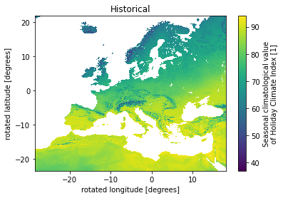

# How to handle CDS Tourism data
## An example use-case for the Dutch province Zuid-Holland

In this notebook we will showcase how data from the Copernicus Climate DataStore (CDS) can be used. 
In particular, the [CDS Climate suitability indicators for tourism](https://cds.climate.copernicus.eu/cdsapp#!/dataset/sis-tourism-climate-suitability-indicators?tab=overview).

We first import some packages


```python
##import packages
import os
import xarray as xr
import numpy as np
import matplotlib.pyplot as plt
import cartopy
import cartopy.crs as ccrs
```

And then download data from CDS. 
Here we choose:
- Index: Both Urban and Beach tourism.
- Variable: Daily (the only option for seasons).
- Time aggregation: summer.
- Scenario: RCP8.5
- Time horizon: 2050

## The Holiday Climate Index (HCI) for *Urban tourism* 

We first look at urban tourism, then beach tourism below. 

Different climate facets (precipitation, wind, cloud cover, and temperature) are considered and a score is given ranging from 0 to 100 (see de Freitas et al., 2008). In general, the higher the value of the indicators is, the more suitable for touristic activities climate conditions are. 

- good conditions: HCI > 70
- fair conditions: 50 < HCI < 70
- unfavorable conditions HCI < 50

### Download data
The below code retrieves the data for our selection. Note that you need to set up the API for CDS, see more [here](https://cds.climate.copernicus.eu/api-how-to) on how to do so.


```python
# import cdsapi

# c = cdsapi.Client()

# c.retrieve(
#     'sis-tourism-climate-suitability-indicators',
#     {
#         'climate_index': 'climate_index_for_tourism',
#         'variable': 'daily_index',
#         'product_type': 'multi_model_mean',
#         'time_aggregation': [
#             'autumn', 'spring', 'summer',
#             'winter',
#         ],
#         'experiment': 'rcp8_5',
#         'period': '2041_2060',
#         'format': 'zip',
#     },
#     './Data/download.zip')
```

And we retrieve the historical data for comparison


```python
# c = cdsapi.Client()

# c.retrieve(
#     'sis-tourism-climate-suitability-indicators',
#     {
#         'climate_index': 'holiday_climate_index',
#         'variable': 'daily_index',
#         'product_type': 'multi_model_mean',
#         'time_aggregation': [
#             'autumn', 'spring', 'summer',
#             'winter',
#         ],
#         'experiment': 'historical',
#         'period': '1986_2005',
#         'format': 'zip',
#     },
#     './Data/download_historical.zip')
```

### Load data

The data is downloaded as a zip file in the 'Data' directory. I manually unzipped it and sorted it in a 'Urban_HCI/Historical' and 'Urban_HCI/RCP85_2050' directory within the 'Data' directory. Now lets load the data:


```python
HCI_jja_hist = xr.open_dataset('./Data/Urban_HCI/Historical/C3S422Lot2TEC_hci-proj_mean_jja_1986_2005_v1.nc')
```


```python
HCI_jja_proj = xr.open_dataset('./Data/Urban_HCI/RCP85_2050/C3S422Lot2TEC_hci-proj_mean_jja_2041_2060_v1.nc')
```

Lets have a look at the xarray dataset for future projections:


```python
HCI_jja_proj
```


<div><svg style="position: absolute; width: 0; height: 0; overflow: hidden">
<defs>
<symbol id="icon-database" viewBox="0 0 32 32">
<path d="M16 0c-8.837 0-16 2.239-16 5v4c0 2.761 7.163 5 16 5s16-2.239 16-5v-4c0-2.761-7.163-5-16-5z"></path>
<path d="M16 17c-8.837 0-16-2.239-16-5v6c0 2.761 7.163 5 16 5s16-2.239 16-5v-6c0 2.761-7.163 5-16 5z"></path>
<path d="M16 26c-8.837 0-16-2.239-16-5v6c0 2.761 7.163 5 16 5s16-2.239 16-5v-6c0 2.761-7.163 5-16 5z"></path>
</symbol>
<symbol id="icon-file-text2" viewBox="0 0 32 32">
<path d="M28.681 7.159c-0.694-0.947-1.662-2.053-2.724-3.116s-2.169-2.030-3.116-2.724c-1.612-1.182-2.393-1.319-2.841-1.319h-15.5c-1.378 0-2.5 1.121-2.5 2.5v27c0 1.378 1.122 2.5 2.5 2.5h23c1.378 0 2.5-1.122 2.5-2.5v-19.5c0-0.448-0.137-1.23-1.319-2.841zM24.543 5.457c0.959 0.959 1.712 1.825 2.268 2.543h-4.811v-4.811c0.718 0.556 1.584 1.309 2.543 2.268zM28 29.5c0 0.271-0.229 0.5-0.5 0.5h-23c-0.271 0-0.5-0.229-0.5-0.5v-27c0-0.271 0.229-0.5 0.5-0.5 0 0 15.499-0 15.5 0v7c0 0.552 0.448 1 1 1h7v19.5z"></path>
<path d="M23 26h-14c-0.552 0-1-0.448-1-1s0.448-1 1-1h14c0.552 0 1 0.448 1 1s-0.448 1-1 1z"></path>
<path d="M23 22h-14c-0.552 0-1-0.448-1-1s0.448-1 1-1h14c0.552 0 1 0.448 1 1s-0.448 1-1 1z"></path>
<path d="M23 18h-14c-0.552 0-1-0.448-1-1s0.448-1 1-1h14c0.552 0 1 0.448 1 1s-0.448 1-1 1z"></path>
</symbol>
</defs>
</svg>
<style>/* CSS stylesheet for displaying xarray objects in jupyterlab.
 *
 */

:root {
  --xr-font-color0: var(--jp-content-font-color0, rgba(0, 0, 0, 1));
  --xr-font-color2: var(--jp-content-font-color2, rgba(0, 0, 0, 0.54));
  --xr-font-color3: var(--jp-content-font-color3, rgba(0, 0, 0, 0.38));
  --xr-border-color: var(--jp-border-color2, #e0e0e0);
  --xr-disabled-color: var(--jp-layout-color3, #bdbdbd);
  --xr-background-color: var(--jp-layout-color0, white);
  --xr-background-color-row-even: var(--jp-layout-color1, white);
  --xr-background-color-row-odd: var(--jp-layout-color2, #eeeeee);
}

html[theme=dark],
body.vscode-dark {
  --xr-font-color0: rgba(255, 255, 255, 1);
  --xr-font-color2: rgba(255, 255, 255, 0.54);
  --xr-font-color3: rgba(255, 255, 255, 0.38);
  --xr-border-color: #1F1F1F;
  --xr-disabled-color: #515151;
  --xr-background-color: #111111;
  --xr-background-color-row-even: #111111;
  --xr-background-color-row-odd: #313131;
}

.xr-wrap {
  display: block !important;
  min-width: 300px;
  max-width: 700px;
}

.xr-text-repr-fallback {
  /* fallback to plain text repr when CSS is not injected (untrusted notebook) */
  display: none;
}

.xr-header {
  padding-top: 6px;
  padding-bottom: 6px;
  margin-bottom: 4px;
  border-bottom: solid 1px var(--xr-border-color);
}

.xr-header > div,
.xr-header > ul {
  display: inline;
  margin-top: 0;
  margin-bottom: 0;
}

.xr-obj-type,
.xr-array-name {
  margin-left: 2px;
  margin-right: 10px;
}

.xr-obj-type {
  color: var(--xr-font-color2);
}

.xr-sections {
  padding-left: 0 !important;
  display: grid;
  grid-template-columns: 150px auto auto 1fr 20px 20px;
}

.xr-section-item {
  display: contents;
}

.xr-section-item input {
  display: none;
}

.xr-section-item input + label {
  color: var(--xr-disabled-color);
}

.xr-section-item input:enabled + label {
  cursor: pointer;
  color: var(--xr-font-color2);
}

.xr-section-item input:enabled + label:hover {
  color: var(--xr-font-color0);
}

.xr-section-summary {
  grid-column: 1;
  color: var(--xr-font-color2);
  font-weight: 500;
}

.xr-section-summary > span {
  display: inline-block;
  padding-left: 0.5em;
}

.xr-section-summary-in:disabled + label {
  color: var(--xr-font-color2);
}

.xr-section-summary-in + label:before {
  display: inline-block;
  content: '►';
  font-size: 11px;
  width: 15px;
  text-align: center;
}

.xr-section-summary-in:disabled + label:before {
  color: var(--xr-disabled-color);
}

.xr-section-summary-in:checked + label:before {
  content: '▼';
}

.xr-section-summary-in:checked + label > span {
  display: none;
}

.xr-section-summary,
.xr-section-inline-details {
  padding-top: 4px;
  padding-bottom: 4px;
}

.xr-section-inline-details {
  grid-column: 2 / -1;
}

.xr-section-details {
  display: none;
  grid-column: 1 / -1;
  margin-bottom: 5px;
}

.xr-section-summary-in:checked ~ .xr-section-details {
  display: contents;
}

.xr-array-wrap {
  grid-column: 1 / -1;
  display: grid;
  grid-template-columns: 20px auto;
}

.xr-array-wrap > label {
  grid-column: 1;
  vertical-align: top;
}

.xr-preview {
  color: var(--xr-font-color3);
}

.xr-array-preview,
.xr-array-data {
  padding: 0 5px !important;
  grid-column: 2;
}

.xr-array-data,
.xr-array-in:checked ~ .xr-array-preview {
  display: none;
}

.xr-array-in:checked ~ .xr-array-data,
.xr-array-preview {
  display: inline-block;
}

.xr-dim-list {
  display: inline-block !important;
  list-style: none;
  padding: 0 !important;
  margin: 0;
}

.xr-dim-list li {
  display: inline-block;
  padding: 0;
  margin: 0;
}

.xr-dim-list:before {
  content: '(';
}

.xr-dim-list:after {
  content: ')';
}

.xr-dim-list li:not(:last-child):after {
  content: ',';
  padding-right: 5px;
}

.xr-has-index {
  font-weight: bold;
}

.xr-var-list,
.xr-var-item {
  display: contents;
}

.xr-var-item > div,
.xr-var-item label,
.xr-var-item > .xr-var-name span {
  background-color: var(--xr-background-color-row-even);
  margin-bottom: 0;
}

.xr-var-item > .xr-var-name:hover span {
  padding-right: 5px;
}

.xr-var-list > li:nth-child(odd) > div,
.xr-var-list > li:nth-child(odd) > label,
.xr-var-list > li:nth-child(odd) > .xr-var-name span {
  background-color: var(--xr-background-color-row-odd);
}

.xr-var-name {
  grid-column: 1;
}

.xr-var-dims {
  grid-column: 2;
}

.xr-var-dtype {
  grid-column: 3;
  text-align: right;
  color: var(--xr-font-color2);
}

.xr-var-preview {
  grid-column: 4;
}

.xr-var-name,
.xr-var-dims,
.xr-var-dtype,
.xr-preview,
.xr-attrs dt {
  white-space: nowrap;
  overflow: hidden;
  text-overflow: ellipsis;
  padding-right: 10px;
}

.xr-var-name:hover,
.xr-var-dims:hover,
.xr-var-dtype:hover,
.xr-attrs dt:hover {
  overflow: visible;
  width: auto;
  z-index: 1;
}

.xr-var-attrs,
.xr-var-data {
  display: none;
  background-color: var(--xr-background-color) !important;
  padding-bottom: 5px !important;
}

.xr-var-attrs-in:checked ~ .xr-var-attrs,
.xr-var-data-in:checked ~ .xr-var-data {
  display: block;
}

.xr-var-data > table {
  float: right;
}

.xr-var-name span,
.xr-var-data,
.xr-attrs {
  padding-left: 25px !important;
}

.xr-attrs,
.xr-var-attrs,
.xr-var-data {
  grid-column: 1 / -1;
}

dl.xr-attrs {
  padding: 0;
  margin: 0;
  display: grid;
  grid-template-columns: 125px auto;
}

.xr-attrs dt,
.xr-attrs dd {
  padding: 0;
  margin: 0;
  float: left;
  padding-right: 10px;
  width: auto;
}

.xr-attrs dt {
  font-weight: normal;
  grid-column: 1;
}

.xr-attrs dt:hover span {
  display: inline-block;
  background: var(--xr-background-color);
  padding-right: 10px;
}

.xr-attrs dd {
  grid-column: 2;
  white-space: pre-wrap;
  word-break: break-all;
}

.xr-icon-database,
.xr-icon-file-text2 {
  display: inline-block;
  vertical-align: middle;
  width: 1em;
  height: 1.5em !important;
  stroke-width: 0;
  stroke: currentColor;
  fill: currentColor;
}
</style><pre class='xr-text-repr-fallback'>&lt;xarray.Dataset&gt;
Dimensions:             (rlat: 412, rlon: 424, time: 1, bnds: 2)
Coordinates:
  * rlat                (rlat) float64 -23.38 -23.27 -23.16 ... 21.73 21.84
  * rlon                (rlon) float64 -28.38 -28.27 -28.16 ... 18.05 18.16
  * time                (time) object 2050-07-15 00:00:00
    lon                 (rlat, rlon) float64 ...
    lat                 (rlat, rlon) float64 ...
Dimensions without coordinates: bnds
Data variables:
    hci-proj            (time, rlat, rlon) float64 ...
    rotated_pole        |S1 b&#x27;&#x27;
    climatology_bounds  (time, bnds) object 2041-06-01 00:00:00 2060-09-01 00...
Attributes: (12/14)
    Conventions:    CF-1.7
    title:          Holiday Climate Index (HCI) scenario seasonal climatology...
    references:     Scott et al. 2016, https://doi.org/10.3390/atmos7060080
    source:         Processing of ECVs from EURO-CORDEX climate projections
    institution:    CMCC, Centro Euro-Mediterraneo sui Cambiamenti Climatici,...
    contact:        http://copernicus-support.ecmwf.int
    ...             ...
    comment:        Ensemble mean over selected EURO-CORDEX projections of JJ...
    history:        
    lineage:        
    summary:        HCI projection data produced by CMCC as its contribution ...
    keywords:       Holiday Climate Index, Climate Projections, C3S, Euro-Cor...
    license:        </pre><div class='xr-wrap' style='display:none'><div class='xr-header'><div class='xr-obj-type'>xarray.Dataset</div></div><ul class='xr-sections'><li class='xr-section-item'><input id='section-9a1090cd-14dd-4d46-a091-57bbcb5610ec' class='xr-section-summary-in' type='checkbox' disabled ><label for='section-9a1090cd-14dd-4d46-a091-57bbcb5610ec' class='xr-section-summary'  title='Expand/collapse section'>Dimensions:</label><div class='xr-section-inline-details'><ul class='xr-dim-list'><li><span class='xr-has-index'>rlat</span>: 412</li><li><span class='xr-has-index'>rlon</span>: 424</li><li><span class='xr-has-index'>time</span>: 1</li><li><span>bnds</span>: 2</li></ul></div><div class='xr-section-details'></div></li><li class='xr-section-item'><input id='section-f15e972f-6870-4412-8e9d-86f5856f346a' class='xr-section-summary-in' type='checkbox'  checked><label for='section-f15e972f-6870-4412-8e9d-86f5856f346a' class='xr-section-summary' >Coordinates: <span>(5)</span></label><div class='xr-section-inline-details'></div><div class='xr-section-details'><ul class='xr-var-list'><li class='xr-var-item'><div class='xr-var-name'><span class='xr-has-index'>rlat</span></div><div class='xr-var-dims'>(rlat)</div><div class='xr-var-dtype'>float64</div><div class='xr-var-preview xr-preview'>-23.38 -23.27 ... 21.73 21.84</div><input id='attrs-c4e91416-0594-4b06-b6b8-70a8ae137694' class='xr-var-attrs-in' type='checkbox' ><label for='attrs-c4e91416-0594-4b06-b6b8-70a8ae137694' title='Show/Hide attributes'><svg class='icon xr-icon-file-text2'><use xlink:href='#icon-file-text2'></use></svg></label><input id='data-cf7e8ab5-de35-44c6-85d8-c8d5ddd29b4b' class='xr-var-data-in' type='checkbox'><label for='data-cf7e8ab5-de35-44c6-85d8-c8d5ddd29b4b' title='Show/Hide data repr'><svg class='icon xr-icon-database'><use xlink:href='#icon-database'></use></svg></label><div class='xr-var-attrs'><dl class='xr-attrs'><dt><span>units :</span></dt><dd>degrees</dd><dt><span>long_name :</span></dt><dd>rotated latitude</dd><dt><span>axis :</span></dt><dd>Y</dd><dt><span>standard_name :</span></dt><dd>grid_latitude</dd><dt><span>_CoordinateAxisType :</span></dt><dd>GeoY</dd></dl></div><div class='xr-var-data'><pre>array([-23.375, -23.265, -23.155, ...,  21.615,  21.725,  21.835])</pre></div></li><li class='xr-var-item'><div class='xr-var-name'><span class='xr-has-index'>rlon</span></div><div class='xr-var-dims'>(rlon)</div><div class='xr-var-dtype'>float64</div><div class='xr-var-preview xr-preview'>-28.38 -28.27 ... 18.05 18.16</div><input id='attrs-e976d44d-8108-4980-bc78-f53bbda7fa0f' class='xr-var-attrs-in' type='checkbox' ><label for='attrs-e976d44d-8108-4980-bc78-f53bbda7fa0f' title='Show/Hide attributes'><svg class='icon xr-icon-file-text2'><use xlink:href='#icon-file-text2'></use></svg></label><input id='data-1fbb8022-aaac-4b4c-8539-490b76e6b314' class='xr-var-data-in' type='checkbox'><label for='data-1fbb8022-aaac-4b4c-8539-490b76e6b314' title='Show/Hide data repr'><svg class='icon xr-icon-database'><use xlink:href='#icon-database'></use></svg></label><div class='xr-var-attrs'><dl class='xr-attrs'><dt><span>units :</span></dt><dd>degrees</dd><dt><span>long_name :</span></dt><dd>rotated longitude</dd><dt><span>axis :</span></dt><dd>X</dd><dt><span>standard_name :</span></dt><dd>grid_longitude</dd><dt><span>_CoordinateAxisType :</span></dt><dd>GeoX</dd></dl></div><div class='xr-var-data'><pre>array([-28.375, -28.265, -28.155, ...,  17.935,  18.045,  18.155])</pre></div></li><li class='xr-var-item'><div class='xr-var-name'><span class='xr-has-index'>time</span></div><div class='xr-var-dims'>(time)</div><div class='xr-var-dtype'>object</div><div class='xr-var-preview xr-preview'>2050-07-15 00:00:00</div><input id='attrs-3cb4016c-bc52-48e1-aad4-a0051cf41d69' class='xr-var-attrs-in' type='checkbox' ><label for='attrs-3cb4016c-bc52-48e1-aad4-a0051cf41d69' title='Show/Hide attributes'><svg class='icon xr-icon-file-text2'><use xlink:href='#icon-file-text2'></use></svg></label><input id='data-3df52469-ca26-415f-9993-69f5aa2c7a8a' class='xr-var-data-in' type='checkbox'><label for='data-3df52469-ca26-415f-9993-69f5aa2c7a8a' title='Show/Hide data repr'><svg class='icon xr-icon-database'><use xlink:href='#icon-database'></use></svg></label><div class='xr-var-attrs'><dl class='xr-attrs'><dt><span>long_name :</span></dt><dd>time</dd><dt><span>standard_name :</span></dt><dd>time</dd><dt><span>climatology :</span></dt><dd>climatology_bounds</dd><dt><span>axis :</span></dt><dd>T</dd></dl></div><div class='xr-var-data'><pre>array([cftime.DatetimeNoLeap(2050, 7, 15, 0, 0, 0, 0, has_year_zero=True)],
      dtype=object)</pre></div></li><li class='xr-var-item'><div class='xr-var-name'><span>lon</span></div><div class='xr-var-dims'>(rlat, rlon)</div><div class='xr-var-dtype'>float64</div><div class='xr-var-preview xr-preview'>...</div><input id='attrs-02d8ced1-e3a7-47e2-b189-752de455951a' class='xr-var-attrs-in' type='checkbox' ><label for='attrs-02d8ced1-e3a7-47e2-b189-752de455951a' title='Show/Hide attributes'><svg class='icon xr-icon-file-text2'><use xlink:href='#icon-file-text2'></use></svg></label><input id='data-8977bf18-ae08-4a3a-8d3d-6c66bbbb997b' class='xr-var-data-in' type='checkbox'><label for='data-8977bf18-ae08-4a3a-8d3d-6c66bbbb997b' title='Show/Hide data repr'><svg class='icon xr-icon-database'><use xlink:href='#icon-database'></use></svg></label><div class='xr-var-attrs'><dl class='xr-attrs'><dt><span>units :</span></dt><dd>degrees_east</dd><dt><span>long_name :</span></dt><dd>longitude</dd><dt><span>standard_name :</span></dt><dd>longitude</dd></dl></div><div class='xr-var-data'><pre>[174688 values with dtype=float64]</pre></div></li><li class='xr-var-item'><div class='xr-var-name'><span>lat</span></div><div class='xr-var-dims'>(rlat, rlon)</div><div class='xr-var-dtype'>float64</div><div class='xr-var-preview xr-preview'>...</div><input id='attrs-1cdcbcd8-879b-4ef2-bf72-9826cbedee16' class='xr-var-attrs-in' type='checkbox' ><label for='attrs-1cdcbcd8-879b-4ef2-bf72-9826cbedee16' title='Show/Hide attributes'><svg class='icon xr-icon-file-text2'><use xlink:href='#icon-file-text2'></use></svg></label><input id='data-4b084e3f-bcbd-4d5d-824d-8e0c9c39c220' class='xr-var-data-in' type='checkbox'><label for='data-4b084e3f-bcbd-4d5d-824d-8e0c9c39c220' title='Show/Hide data repr'><svg class='icon xr-icon-database'><use xlink:href='#icon-database'></use></svg></label><div class='xr-var-attrs'><dl class='xr-attrs'><dt><span>units :</span></dt><dd>degrees_north</dd><dt><span>long_name :</span></dt><dd>latitude</dd><dt><span>standard_name :</span></dt><dd>latitude</dd></dl></div><div class='xr-var-data'><pre>[174688 values with dtype=float64]</pre></div></li></ul></div></li><li class='xr-section-item'><input id='section-3b4f556c-37f0-4542-9935-ca94657ae150' class='xr-section-summary-in' type='checkbox'  checked><label for='section-3b4f556c-37f0-4542-9935-ca94657ae150' class='xr-section-summary' >Data variables: <span>(3)</span></label><div class='xr-section-inline-details'></div><div class='xr-section-details'><ul class='xr-var-list'><li class='xr-var-item'><div class='xr-var-name'><span>hci-proj</span></div><div class='xr-var-dims'>(time, rlat, rlon)</div><div class='xr-var-dtype'>float64</div><div class='xr-var-preview xr-preview'>...</div><input id='attrs-cd2e004a-710a-4d3d-8d1f-9563e7c73a3c' class='xr-var-attrs-in' type='checkbox' ><label for='attrs-cd2e004a-710a-4d3d-8d1f-9563e7c73a3c' title='Show/Hide attributes'><svg class='icon xr-icon-file-text2'><use xlink:href='#icon-file-text2'></use></svg></label><input id='data-2be4f305-4813-4248-8d80-97e75e431cf1' class='xr-var-data-in' type='checkbox'><label for='data-2be4f305-4813-4248-8d80-97e75e431cf1' title='Show/Hide data repr'><svg class='icon xr-icon-database'><use xlink:href='#icon-database'></use></svg></label><div class='xr-var-attrs'><dl class='xr-attrs'><dt><span>units :</span></dt><dd>1</dd><dt><span>long_name :</span></dt><dd>Seasonal climatological value of Holiday Climate Index</dd><dt><span>short_name :</span></dt><dd>hci-proj</dd><dt><span>standard_name :</span></dt><dd>hci-proj</dd><dt><span>cell_methods :</span></dt><dd>time: mean within years time: mean over years</dd><dt><span>grid_mapping :</span></dt><dd>rotated_latitude_longitude</dd></dl></div><div class='xr-var-data'><pre>[174688 values with dtype=float64]</pre></div></li><li class='xr-var-item'><div class='xr-var-name'><span>rotated_pole</span></div><div class='xr-var-dims'>()</div><div class='xr-var-dtype'>|S1</div><div class='xr-var-preview xr-preview'>...</div><input id='attrs-47896de0-d8d3-4e0b-8a0a-8bc968e01389' class='xr-var-attrs-in' type='checkbox' ><label for='attrs-47896de0-d8d3-4e0b-8a0a-8bc968e01389' title='Show/Hide attributes'><svg class='icon xr-icon-file-text2'><use xlink:href='#icon-file-text2'></use></svg></label><input id='data-65cb84b5-ace1-4d2b-81c2-3e0ea3f5e2a1' class='xr-var-data-in' type='checkbox'><label for='data-65cb84b5-ace1-4d2b-81c2-3e0ea3f5e2a1' title='Show/Hide data repr'><svg class='icon xr-icon-database'><use xlink:href='#icon-database'></use></svg></label><div class='xr-var-attrs'><dl class='xr-attrs'><dt><span>grid_mapping_name :</span></dt><dd>rotated_latitude_longitude</dd><dt><span>grid_north_pole_latitude :</span></dt><dd>39.25</dd><dt><span>grid_north_pole_longitude :</span></dt><dd>-162.0</dd><dt><span>_CoordinateTransformType :</span></dt><dd>Projection</dd><dt><span>_CoordinateAxisTypes :</span></dt><dd>GeoX GeoY</dd></dl></div><div class='xr-var-data'><pre>array(b&#x27;&#x27;, dtype=&#x27;|S1&#x27;)</pre></div></li><li class='xr-var-item'><div class='xr-var-name'><span>climatology_bounds</span></div><div class='xr-var-dims'>(time, bnds)</div><div class='xr-var-dtype'>object</div><div class='xr-var-preview xr-preview'>...</div><input id='attrs-558ea7d5-a396-4109-9271-d0f8e1cc36c2' class='xr-var-attrs-in' type='checkbox' ><label for='attrs-558ea7d5-a396-4109-9271-d0f8e1cc36c2' title='Show/Hide attributes'><svg class='icon xr-icon-file-text2'><use xlink:href='#icon-file-text2'></use></svg></label><input id='data-7f364969-1054-4246-bf2b-23be01b8e826' class='xr-var-data-in' type='checkbox'><label for='data-7f364969-1054-4246-bf2b-23be01b8e826' title='Show/Hide data repr'><svg class='icon xr-icon-database'><use xlink:href='#icon-database'></use></svg></label><div class='xr-var-attrs'><dl class='xr-attrs'><dt><span>cell_methods :</span></dt><dd>time: mean within years time: mean over years</dd></dl></div><div class='xr-var-data'><pre>array([[cftime.DatetimeNoLeap(2041, 6, 1, 0, 0, 0, 0, has_year_zero=True),
        cftime.DatetimeNoLeap(2060, 9, 1, 0, 0, 0, 0, has_year_zero=True)]],
      dtype=object)</pre></div></li></ul></div></li><li class='xr-section-item'><input id='section-70aca710-dc22-4c0f-a365-c00a31e2729b' class='xr-section-summary-in' type='checkbox'  ><label for='section-70aca710-dc22-4c0f-a365-c00a31e2729b' class='xr-section-summary' >Attributes: <span>(14)</span></label><div class='xr-section-inline-details'></div><div class='xr-section-details'><dl class='xr-attrs'><dt><span>Conventions :</span></dt><dd>CF-1.7</dd><dt><span>title :</span></dt><dd>Holiday Climate Index (HCI) scenario seasonal climatology for C3S European Tourism</dd><dt><span>references :</span></dt><dd>Scott et al. 2016, https://doi.org/10.3390/atmos7060080</dd><dt><span>source :</span></dt><dd>Processing of ECVs from EURO-CORDEX climate projections</dd><dt><span>institution :</span></dt><dd>CMCC, Centro Euro-Mediterraneo sui Cambiamenti Climatici, Bologna, Italy</dd><dt><span>contact :</span></dt><dd>http://copernicus-support.ecmwf.int</dd><dt><span>project :</span></dt><dd>C3S European Tourism (C3S_422_Lot2_TEC)</dd><dt><span>creation_date :</span></dt><dd>Thu Aug 29 14:49:51 2019</dd><dt><span>comment :</span></dt><dd>Ensemble mean over selected EURO-CORDEX projections of JJA climatologies computed for the RCP85 scenario (2041-2060)</dd><dt><span>history :</span></dt><dd></dd><dt><span>lineage :</span></dt><dd></dd><dt><span>summary :</span></dt><dd>HCI projection data produced by CMCC as its contribution to the C3S European Tourism project. The data cover the Euro-CORDEX domain with a 0.11 degree horizontal resolution and spans both historical and scenario periods&quot; ;</dd><dt><span>keywords :</span></dt><dd>Holiday Climate Index, Climate Projections, C3S, Euro-Cordex, Copernicus, Climate Change, Sectoral Climate Impact Indicators</dd><dt><span>license :</span></dt><dd></dd></dl></div></li></ul></div></div>


### Making the maps
With the data loaded, we can now make some plots of the data! Read more about plotting with xarray [here](https://docs.xarray.dev/en/stable/user-guide/plotting.html#two-dimensions).

#### Historical and future projections of the holiday climate index for urban tourism

Different climate facets (precipitation, wind, cloud cover, and temperature) are considered and a score is given ranging from 0 to 100 (see de Freitas et al., 2008). In general, the higher the value of the indicators is, the more suitable for touristic activities climate conditions are. 

- good conditions: HCI > 70
- fair conditions: 50 < HCI < 70
- unfavorable conditions HCI < 50


```python
HCI_jja_hist['hci-proj'].plot()
plt.title('Historical')
plt.savefig('./Graphs/HCI_jja_hist.png')
```


    

    


```python
HCI_jja_proj['hci-proj'].plot()
plt.title('2050')
plt.savefig('./Graphs/HCI_jja_RCP85_2050.png')
```


    

    


#### Trend in the holiday climate index for urban tourism
I now calculate the difference between the projection and historical data. Note that I need to load the data in memory first before doing the calculation and I need to drop the time dimension. 


```python
HCI_jja_hist.load()
HCI_jja_proj.load()
HCI_proj_min_hist = (HCI_jja_proj['hci-proj'].drop('time')-HCI_jja_hist['hci-proj'].drop('time'))
```


```python
HCI_proj_min_hist.plot()
plt.title('2050 - historical')
plt.savefig('./Graphs/HCI_jja_change.png')
```


    

    


#### More advanced plotting and Zooming in on Zuid-Holland
We want to zoom in on Zuid-Holland. The data has this odd 'rotated' latitude and longitude, such that the original values for Zuid Holland (~52, ~4.5) don't translate. Therefore I am setting up a new projection and transform the rotated pole onto it. 

<!-- I `slice` the values to make a new zoomed-in plot. For this new plot I want to keep the colorbar values and colors.  -->


```python
# plt.figure()

ax = plt.axes(projection=ccrs.UTM(32))

HCI_jja_hist['hci-proj'].sel(rlat = slice (0,4),
                                 rlon = slice (-10,-6)).plot(
    transform=ccrs.RotatedPole(
        pole_longitude = -162.0,
        pole_latitude = 39.25,
    ),
    vmin = 65,
    vmax = 75,
    ax=ax
)

ax.coastlines(resolution='10m')
ax.add_feature(cartopy.feature.BORDERS, linestyle=':')
gl = ax.gridlines(crs=ccrs.PlateCarree(),
                  draw_labels=True,     # cannot label OSGB projection..
                  linewidth=1,
                  color='gray',
                  alpha=0.5,
                  linestyle='--')
gl.top_labels = False
gl.right_labels = False
ax.set_extent([3, 8, 50.8, 54])
ax.set_title('Historical')
plt.tight_layout()
plt.savefig('./Graphs/Urban_NL.png', dpi=300)

```


    

    


```python
fig, axs = plt.subplots(2, 2, subplot_kw={'projection': ccrs.EuroPP()})

##Topleft panel
HCI_jja_hist['hci-proj'].plot(
    transform=ccrs.RotatedPole(
        pole_longitude = -162.0,
        pole_latitude = 39.25,
    ),
    vmin = 40,
    vmax = 90,
    ax=axs[0,0],
    cbar_kwargs={'label': ""}
)
    
##Topright panel
HCI_jja_proj['hci-proj'].plot(
    transform=ccrs.RotatedPole(
        pole_longitude = -162.0,
        pole_latitude = 39.25,
    ),
    vmin = 40,
    vmax = 90,
    ax=axs[0,1],
    cbar_kwargs={'label': "Zomer stedelijke toerisme index \n (0 tot 100, hoger is beter)"} 
)

##Bottomleft panel
HCI_jja_hist['hci-proj'].sel(rlat = slice (0,4),
                                 rlon = slice (-10,-6)).plot(
    transform=ccrs.RotatedPole(
        pole_longitude = -162.0,
        pole_latitude = 39.25,
    ),
    vmin = 65,
    vmax = 75,
    ax=axs[1,0],
    cbar_kwargs={'label': ""}
)
    
##Bottomright panel
HCI_jja_proj['hci-proj'].sel(rlat = slice (0,4),
                                 rlon = slice (-10,-6)).plot(
    transform=ccrs.RotatedPole(
        pole_longitude = -162.0,
        pole_latitude = 39.25,
    ),
    vmin = 65,
    vmax = 75,
    ax=axs[1,1],
    cbar_kwargs={'label': ""}
)
 
for ax in axs.flat:
    ax.coastlines(resolution='10m')
    ax.add_feature(cartopy.feature.BORDERS, linestyle=':')
    gl = ax.gridlines(crs=ccrs.PlateCarree(),
                  draw_labels=True,     # cannot label OSGB projection..
                  linewidth=1,
                  color='gray',
                  alpha=0.5,
                  linestyle='--')
    gl.top_labels = False
    gl.right_labels = False
    
axs[1,0].set_extent([3, 8, 50.8, 54])
axs[1,1].set_extent([3, 8, 50.8, 54])
axs[0,0].set_title('Historisch')
axs[0,1].set_title('2050')
axs[1,0].set_title('Historisch')
axs[1,1].set_title('2050')

plt.tight_layout()
plt.savefig('./Graphs/Urban.pdf', dpi=300)

```


    

    


```python
p = HCI_proj_min_hist.sel(rlat = slice (-3,3), 
                      rlon = slice (-15,-5)).plot(
    vmin = -10,
    vmax = 10,
    cmap=plt.cm.RdBu_r
)

plt.title('2050 - historical')
plt.savefig('./Graphs/HCI_jja_change_zoom.png')
```


    

    


####  Find a lat long point in the rotated coordinate system
Below I find the values for the point lon 4,5 and lat 52
- Historical: 72.85
- 2050: 75


```python
data_crs = ccrs.RotatedPole(
        pole_longitude = -162.0,
        pole_latitude = 39.25,
    )
```


```python
# Transform the point - src_crs is always Plate Carree for lat/lon grid
lon, lat = data_crs.transform_point(x = 4.49882022,
                                y = 52.02109482,
                                src_crs=ccrs.PlateCarree())
```


```python
# Now you can select data
HCI_jja_hist['hci-proj'].sel(rlon=lon, rlat=lat, method="nearest")
```


<div><svg style="position: absolute; width: 0; height: 0; overflow: hidden">
<defs>
<symbol id="icon-database" viewBox="0 0 32 32">
<path d="M16 0c-8.837 0-16 2.239-16 5v4c0 2.761 7.163 5 16 5s16-2.239 16-5v-4c0-2.761-7.163-5-16-5z"></path>
<path d="M16 17c-8.837 0-16-2.239-16-5v6c0 2.761 7.163 5 16 5s16-2.239 16-5v-6c0 2.761-7.163 5-16 5z"></path>
<path d="M16 26c-8.837 0-16-2.239-16-5v6c0 2.761 7.163 5 16 5s16-2.239 16-5v-6c0 2.761-7.163 5-16 5z"></path>
</symbol>
<symbol id="icon-file-text2" viewBox="0 0 32 32">
<path d="M28.681 7.159c-0.694-0.947-1.662-2.053-2.724-3.116s-2.169-2.030-3.116-2.724c-1.612-1.182-2.393-1.319-2.841-1.319h-15.5c-1.378 0-2.5 1.121-2.5 2.5v27c0 1.378 1.122 2.5 2.5 2.5h23c1.378 0 2.5-1.122 2.5-2.5v-19.5c0-0.448-0.137-1.23-1.319-2.841zM24.543 5.457c0.959 0.959 1.712 1.825 2.268 2.543h-4.811v-4.811c0.718 0.556 1.584 1.309 2.543 2.268zM28 29.5c0 0.271-0.229 0.5-0.5 0.5h-23c-0.271 0-0.5-0.229-0.5-0.5v-27c0-0.271 0.229-0.5 0.5-0.5 0 0 15.499-0 15.5 0v7c0 0.552 0.448 1 1 1h7v19.5z"></path>
<path d="M23 26h-14c-0.552 0-1-0.448-1-1s0.448-1 1-1h14c0.552 0 1 0.448 1 1s-0.448 1-1 1z"></path>
<path d="M23 22h-14c-0.552 0-1-0.448-1-1s0.448-1 1-1h14c0.552 0 1 0.448 1 1s-0.448 1-1 1z"></path>
<path d="M23 18h-14c-0.552 0-1-0.448-1-1s0.448-1 1-1h14c0.552 0 1 0.448 1 1s-0.448 1-1 1z"></path>
</symbol>
</defs>
</svg>
<style>/* CSS stylesheet for displaying xarray objects in jupyterlab.
 *
 */

:root {
  --xr-font-color0: var(--jp-content-font-color0, rgba(0, 0, 0, 1));
  --xr-font-color2: var(--jp-content-font-color2, rgba(0, 0, 0, 0.54));
  --xr-font-color3: var(--jp-content-font-color3, rgba(0, 0, 0, 0.38));
  --xr-border-color: var(--jp-border-color2, #e0e0e0);
  --xr-disabled-color: var(--jp-layout-color3, #bdbdbd);
  --xr-background-color: var(--jp-layout-color0, white);
  --xr-background-color-row-even: var(--jp-layout-color1, white);
  --xr-background-color-row-odd: var(--jp-layout-color2, #eeeeee);
}

html[theme=dark],
body.vscode-dark {
  --xr-font-color0: rgba(255, 255, 255, 1);
  --xr-font-color2: rgba(255, 255, 255, 0.54);
  --xr-font-color3: rgba(255, 255, 255, 0.38);
  --xr-border-color: #1F1F1F;
  --xr-disabled-color: #515151;
  --xr-background-color: #111111;
  --xr-background-color-row-even: #111111;
  --xr-background-color-row-odd: #313131;
}

.xr-wrap {
  display: block !important;
  min-width: 300px;
  max-width: 700px;
}

.xr-text-repr-fallback {
  /* fallback to plain text repr when CSS is not injected (untrusted notebook) */
  display: none;
}

.xr-header {
  padding-top: 6px;
  padding-bottom: 6px;
  margin-bottom: 4px;
  border-bottom: solid 1px var(--xr-border-color);
}

.xr-header > div,
.xr-header > ul {
  display: inline;
  margin-top: 0;
  margin-bottom: 0;
}

.xr-obj-type,
.xr-array-name {
  margin-left: 2px;
  margin-right: 10px;
}

.xr-obj-type {
  color: var(--xr-font-color2);
}

.xr-sections {
  padding-left: 0 !important;
  display: grid;
  grid-template-columns: 150px auto auto 1fr 20px 20px;
}

.xr-section-item {
  display: contents;
}

.xr-section-item input {
  display: none;
}

.xr-section-item input + label {
  color: var(--xr-disabled-color);
}

.xr-section-item input:enabled + label {
  cursor: pointer;
  color: var(--xr-font-color2);
}

.xr-section-item input:enabled + label:hover {
  color: var(--xr-font-color0);
}

.xr-section-summary {
  grid-column: 1;
  color: var(--xr-font-color2);
  font-weight: 500;
}

.xr-section-summary > span {
  display: inline-block;
  padding-left: 0.5em;
}

.xr-section-summary-in:disabled + label {
  color: var(--xr-font-color2);
}

.xr-section-summary-in + label:before {
  display: inline-block;
  content: '►';
  font-size: 11px;
  width: 15px;
  text-align: center;
}

.xr-section-summary-in:disabled + label:before {
  color: var(--xr-disabled-color);
}

.xr-section-summary-in:checked + label:before {
  content: '▼';
}

.xr-section-summary-in:checked + label > span {
  display: none;
}

.xr-section-summary,
.xr-section-inline-details {
  padding-top: 4px;
  padding-bottom: 4px;
}

.xr-section-inline-details {
  grid-column: 2 / -1;
}

.xr-section-details {
  display: none;
  grid-column: 1 / -1;
  margin-bottom: 5px;
}

.xr-section-summary-in:checked ~ .xr-section-details {
  display: contents;
}

.xr-array-wrap {
  grid-column: 1 / -1;
  display: grid;
  grid-template-columns: 20px auto;
}

.xr-array-wrap > label {
  grid-column: 1;
  vertical-align: top;
}

.xr-preview {
  color: var(--xr-font-color3);
}

.xr-array-preview,
.xr-array-data {
  padding: 0 5px !important;
  grid-column: 2;
}

.xr-array-data,
.xr-array-in:checked ~ .xr-array-preview {
  display: none;
}

.xr-array-in:checked ~ .xr-array-data,
.xr-array-preview {
  display: inline-block;
}

.xr-dim-list {
  display: inline-block !important;
  list-style: none;
  padding: 0 !important;
  margin: 0;
}

.xr-dim-list li {
  display: inline-block;
  padding: 0;
  margin: 0;
}

.xr-dim-list:before {
  content: '(';
}

.xr-dim-list:after {
  content: ')';
}

.xr-dim-list li:not(:last-child):after {
  content: ',';
  padding-right: 5px;
}

.xr-has-index {
  font-weight: bold;
}

.xr-var-list,
.xr-var-item {
  display: contents;
}

.xr-var-item > div,
.xr-var-item label,
.xr-var-item > .xr-var-name span {
  background-color: var(--xr-background-color-row-even);
  margin-bottom: 0;
}

.xr-var-item > .xr-var-name:hover span {
  padding-right: 5px;
}

.xr-var-list > li:nth-child(odd) > div,
.xr-var-list > li:nth-child(odd) > label,
.xr-var-list > li:nth-child(odd) > .xr-var-name span {
  background-color: var(--xr-background-color-row-odd);
}

.xr-var-name {
  grid-column: 1;
}

.xr-var-dims {
  grid-column: 2;
}

.xr-var-dtype {
  grid-column: 3;
  text-align: right;
  color: var(--xr-font-color2);
}

.xr-var-preview {
  grid-column: 4;
}

.xr-var-name,
.xr-var-dims,
.xr-var-dtype,
.xr-preview,
.xr-attrs dt {
  white-space: nowrap;
  overflow: hidden;
  text-overflow: ellipsis;
  padding-right: 10px;
}

.xr-var-name:hover,
.xr-var-dims:hover,
.xr-var-dtype:hover,
.xr-attrs dt:hover {
  overflow: visible;
  width: auto;
  z-index: 1;
}

.xr-var-attrs,
.xr-var-data {
  display: none;
  background-color: var(--xr-background-color) !important;
  padding-bottom: 5px !important;
}

.xr-var-attrs-in:checked ~ .xr-var-attrs,
.xr-var-data-in:checked ~ .xr-var-data {
  display: block;
}

.xr-var-data > table {
  float: right;
}

.xr-var-name span,
.xr-var-data,
.xr-attrs {
  padding-left: 25px !important;
}

.xr-attrs,
.xr-var-attrs,
.xr-var-data {
  grid-column: 1 / -1;
}

dl.xr-attrs {
  padding: 0;
  margin: 0;
  display: grid;
  grid-template-columns: 125px auto;
}

.xr-attrs dt,
.xr-attrs dd {
  padding: 0;
  margin: 0;
  float: left;
  padding-right: 10px;
  width: auto;
}

.xr-attrs dt {
  font-weight: normal;
  grid-column: 1;
}

.xr-attrs dt:hover span {
  display: inline-block;
  background: var(--xr-background-color);
  padding-right: 10px;
}

.xr-attrs dd {
  grid-column: 2;
  white-space: pre-wrap;
  word-break: break-all;
}

.xr-icon-database,
.xr-icon-file-text2 {
  display: inline-block;
  vertical-align: middle;
  width: 1em;
  height: 1.5em !important;
  stroke-width: 0;
  stroke: currentColor;
  fill: currentColor;
}
</style><pre class='xr-text-repr-fallback'>&lt;xarray.DataArray &#x27;hci-proj&#x27; (time: 1)&gt;
array([72.84859916])
Coordinates:
    rlat     float64 2.035
    rlon     float64 -8.245
  * time     (time) object 1995-07-15 00:00:00
    lon      float64 4.529
    lat      float64 52.03
Attributes:
    units:          1
    long_name:      Seasonal climatological value of Holiday Climate Index
    short_name:     hci-proj
    standard_name:  hci-proj
    cell_methods:   time: mean within years time: mean over years
    grid_mapping:   rotated_latitude_longitude</pre><div class='xr-wrap' style='display:none'><div class='xr-header'><div class='xr-obj-type'>xarray.DataArray</div><div class='xr-array-name'>'hci-proj'</div><ul class='xr-dim-list'><li><span class='xr-has-index'>time</span>: 1</li></ul></div><ul class='xr-sections'><li class='xr-section-item'><div class='xr-array-wrap'><input id='section-c2381bfd-53ec-43a0-9227-1d190428601d' class='xr-array-in' type='checkbox' checked><label for='section-c2381bfd-53ec-43a0-9227-1d190428601d' title='Show/hide data repr'><svg class='icon xr-icon-database'><use xlink:href='#icon-database'></use></svg></label><div class='xr-array-preview xr-preview'><span>72.85</span></div><div class='xr-array-data'><pre>array([72.84859916])</pre></div></div></li><li class='xr-section-item'><input id='section-fab10418-2ad7-4e0d-b344-48b126abe633' class='xr-section-summary-in' type='checkbox'  checked><label for='section-fab10418-2ad7-4e0d-b344-48b126abe633' class='xr-section-summary' >Coordinates: <span>(5)</span></label><div class='xr-section-inline-details'></div><div class='xr-section-details'><ul class='xr-var-list'><li class='xr-var-item'><div class='xr-var-name'><span>rlat</span></div><div class='xr-var-dims'>()</div><div class='xr-var-dtype'>float64</div><div class='xr-var-preview xr-preview'>2.035</div><input id='attrs-b256450c-2b20-4698-a1e5-1908e6c787bc' class='xr-var-attrs-in' type='checkbox' ><label for='attrs-b256450c-2b20-4698-a1e5-1908e6c787bc' title='Show/Hide attributes'><svg class='icon xr-icon-file-text2'><use xlink:href='#icon-file-text2'></use></svg></label><input id='data-2069d3ac-7401-4f1c-8cc6-7e875857ed6a' class='xr-var-data-in' type='checkbox'><label for='data-2069d3ac-7401-4f1c-8cc6-7e875857ed6a' title='Show/Hide data repr'><svg class='icon xr-icon-database'><use xlink:href='#icon-database'></use></svg></label><div class='xr-var-attrs'><dl class='xr-attrs'><dt><span>units :</span></dt><dd>degrees</dd><dt><span>long_name :</span></dt><dd>rotated latitude</dd><dt><span>axis :</span></dt><dd>Y</dd><dt><span>standard_name :</span></dt><dd>grid_latitude</dd><dt><span>_CoordinateAxisType :</span></dt><dd>GeoY</dd></dl></div><div class='xr-var-data'><pre>array(2.035)</pre></div></li><li class='xr-var-item'><div class='xr-var-name'><span>rlon</span></div><div class='xr-var-dims'>()</div><div class='xr-var-dtype'>float64</div><div class='xr-var-preview xr-preview'>-8.245</div><input id='attrs-ed4d0a95-32d7-4cd5-9a8a-b4a6f9a445cb' class='xr-var-attrs-in' type='checkbox' ><label for='attrs-ed4d0a95-32d7-4cd5-9a8a-b4a6f9a445cb' title='Show/Hide attributes'><svg class='icon xr-icon-file-text2'><use xlink:href='#icon-file-text2'></use></svg></label><input id='data-c7302676-15ff-4bed-a3ab-c23fb6ad329d' class='xr-var-data-in' type='checkbox'><label for='data-c7302676-15ff-4bed-a3ab-c23fb6ad329d' title='Show/Hide data repr'><svg class='icon xr-icon-database'><use xlink:href='#icon-database'></use></svg></label><div class='xr-var-attrs'><dl class='xr-attrs'><dt><span>units :</span></dt><dd>degrees</dd><dt><span>long_name :</span></dt><dd>rotated longitude</dd><dt><span>axis :</span></dt><dd>X</dd><dt><span>standard_name :</span></dt><dd>grid_longitude</dd><dt><span>_CoordinateAxisType :</span></dt><dd>GeoX</dd></dl></div><div class='xr-var-data'><pre>array(-8.245)</pre></div></li><li class='xr-var-item'><div class='xr-var-name'><span class='xr-has-index'>time</span></div><div class='xr-var-dims'>(time)</div><div class='xr-var-dtype'>object</div><div class='xr-var-preview xr-preview'>1995-07-15 00:00:00</div><input id='attrs-16ba7a5e-eadf-43d1-9d3e-de0527f51dbe' class='xr-var-attrs-in' type='checkbox' ><label for='attrs-16ba7a5e-eadf-43d1-9d3e-de0527f51dbe' title='Show/Hide attributes'><svg class='icon xr-icon-file-text2'><use xlink:href='#icon-file-text2'></use></svg></label><input id='data-19ef6eed-085d-47d0-aa93-dc2a4d25f216' class='xr-var-data-in' type='checkbox'><label for='data-19ef6eed-085d-47d0-aa93-dc2a4d25f216' title='Show/Hide data repr'><svg class='icon xr-icon-database'><use xlink:href='#icon-database'></use></svg></label><div class='xr-var-attrs'><dl class='xr-attrs'><dt><span>long_name :</span></dt><dd>time</dd><dt><span>standard_name :</span></dt><dd>time</dd><dt><span>climatology :</span></dt><dd>climatology_bounds</dd><dt><span>axis :</span></dt><dd>T</dd></dl></div><div class='xr-var-data'><pre>array([cftime.DatetimeNoLeap(1995, 7, 15, 0, 0, 0, 0, has_year_zero=True)],
      dtype=object)</pre></div></li><li class='xr-var-item'><div class='xr-var-name'><span>lon</span></div><div class='xr-var-dims'>()</div><div class='xr-var-dtype'>float64</div><div class='xr-var-preview xr-preview'>4.529</div><input id='attrs-6cfe30ff-d1b4-41c5-8669-23053395ba36' class='xr-var-attrs-in' type='checkbox' ><label for='attrs-6cfe30ff-d1b4-41c5-8669-23053395ba36' title='Show/Hide attributes'><svg class='icon xr-icon-file-text2'><use xlink:href='#icon-file-text2'></use></svg></label><input id='data-e2b85b91-16a0-471d-a99a-a2ba77fd6d82' class='xr-var-data-in' type='checkbox'><label for='data-e2b85b91-16a0-471d-a99a-a2ba77fd6d82' title='Show/Hide data repr'><svg class='icon xr-icon-database'><use xlink:href='#icon-database'></use></svg></label><div class='xr-var-attrs'><dl class='xr-attrs'><dt><span>units :</span></dt><dd>degrees_east</dd><dt><span>long_name :</span></dt><dd>longitude</dd><dt><span>standard_name :</span></dt><dd>longitude</dd></dl></div><div class='xr-var-data'><pre>array(4.5286711)</pre></div></li><li class='xr-var-item'><div class='xr-var-name'><span>lat</span></div><div class='xr-var-dims'>()</div><div class='xr-var-dtype'>float64</div><div class='xr-var-preview xr-preview'>52.03</div><input id='attrs-8556edc0-7342-4206-a4a2-5c574ca5db06' class='xr-var-attrs-in' type='checkbox' ><label for='attrs-8556edc0-7342-4206-a4a2-5c574ca5db06' title='Show/Hide attributes'><svg class='icon xr-icon-file-text2'><use xlink:href='#icon-file-text2'></use></svg></label><input id='data-d1a03e96-311f-4b2f-99cf-f6c1c5b1c865' class='xr-var-data-in' type='checkbox'><label for='data-d1a03e96-311f-4b2f-99cf-f6c1c5b1c865' title='Show/Hide data repr'><svg class='icon xr-icon-database'><use xlink:href='#icon-database'></use></svg></label><div class='xr-var-attrs'><dl class='xr-attrs'><dt><span>units :</span></dt><dd>degrees_north</dd><dt><span>long_name :</span></dt><dd>latitude</dd><dt><span>standard_name :</span></dt><dd>latitude</dd></dl></div><div class='xr-var-data'><pre>array(52.03367436)</pre></div></li></ul></div></li><li class='xr-section-item'><input id='section-13f49139-5d75-462b-a106-b70c39f9fdbf' class='xr-section-summary-in' type='checkbox'  checked><label for='section-13f49139-5d75-462b-a106-b70c39f9fdbf' class='xr-section-summary' >Attributes: <span>(6)</span></label><div class='xr-section-inline-details'></div><div class='xr-section-details'><dl class='xr-attrs'><dt><span>units :</span></dt><dd>1</dd><dt><span>long_name :</span></dt><dd>Seasonal climatological value of Holiday Climate Index</dd><dt><span>short_name :</span></dt><dd>hci-proj</dd><dt><span>standard_name :</span></dt><dd>hci-proj</dd><dt><span>cell_methods :</span></dt><dd>time: mean within years time: mean over years</dd><dt><span>grid_mapping :</span></dt><dd>rotated_latitude_longitude</dd></dl></div></li></ul></div></div>


```python
HCI_jja_proj['hci-proj'].sel(rlon=lon, rlat=lat, method="nearest")
```


<div><svg style="position: absolute; width: 0; height: 0; overflow: hidden">
<defs>
<symbol id="icon-database" viewBox="0 0 32 32">
<path d="M16 0c-8.837 0-16 2.239-16 5v4c0 2.761 7.163 5 16 5s16-2.239 16-5v-4c0-2.761-7.163-5-16-5z"></path>
<path d="M16 17c-8.837 0-16-2.239-16-5v6c0 2.761 7.163 5 16 5s16-2.239 16-5v-6c0 2.761-7.163 5-16 5z"></path>
<path d="M16 26c-8.837 0-16-2.239-16-5v6c0 2.761 7.163 5 16 5s16-2.239 16-5v-6c0 2.761-7.163 5-16 5z"></path>
</symbol>
<symbol id="icon-file-text2" viewBox="0 0 32 32">
<path d="M28.681 7.159c-0.694-0.947-1.662-2.053-2.724-3.116s-2.169-2.030-3.116-2.724c-1.612-1.182-2.393-1.319-2.841-1.319h-15.5c-1.378 0-2.5 1.121-2.5 2.5v27c0 1.378 1.122 2.5 2.5 2.5h23c1.378 0 2.5-1.122 2.5-2.5v-19.5c0-0.448-0.137-1.23-1.319-2.841zM24.543 5.457c0.959 0.959 1.712 1.825 2.268 2.543h-4.811v-4.811c0.718 0.556 1.584 1.309 2.543 2.268zM28 29.5c0 0.271-0.229 0.5-0.5 0.5h-23c-0.271 0-0.5-0.229-0.5-0.5v-27c0-0.271 0.229-0.5 0.5-0.5 0 0 15.499-0 15.5 0v7c0 0.552 0.448 1 1 1h7v19.5z"></path>
<path d="M23 26h-14c-0.552 0-1-0.448-1-1s0.448-1 1-1h14c0.552 0 1 0.448 1 1s-0.448 1-1 1z"></path>
<path d="M23 22h-14c-0.552 0-1-0.448-1-1s0.448-1 1-1h14c0.552 0 1 0.448 1 1s-0.448 1-1 1z"></path>
<path d="M23 18h-14c-0.552 0-1-0.448-1-1s0.448-1 1-1h14c0.552 0 1 0.448 1 1s-0.448 1-1 1z"></path>
</symbol>
</defs>
</svg>
<style>/* CSS stylesheet for displaying xarray objects in jupyterlab.
 *
 */

:root {
  --xr-font-color0: var(--jp-content-font-color0, rgba(0, 0, 0, 1));
  --xr-font-color2: var(--jp-content-font-color2, rgba(0, 0, 0, 0.54));
  --xr-font-color3: var(--jp-content-font-color3, rgba(0, 0, 0, 0.38));
  --xr-border-color: var(--jp-border-color2, #e0e0e0);
  --xr-disabled-color: var(--jp-layout-color3, #bdbdbd);
  --xr-background-color: var(--jp-layout-color0, white);
  --xr-background-color-row-even: var(--jp-layout-color1, white);
  --xr-background-color-row-odd: var(--jp-layout-color2, #eeeeee);
}

html[theme=dark],
body.vscode-dark {
  --xr-font-color0: rgba(255, 255, 255, 1);
  --xr-font-color2: rgba(255, 255, 255, 0.54);
  --xr-font-color3: rgba(255, 255, 255, 0.38);
  --xr-border-color: #1F1F1F;
  --xr-disabled-color: #515151;
  --xr-background-color: #111111;
  --xr-background-color-row-even: #111111;
  --xr-background-color-row-odd: #313131;
}

.xr-wrap {
  display: block !important;
  min-width: 300px;
  max-width: 700px;
}

.xr-text-repr-fallback {
  /* fallback to plain text repr when CSS is not injected (untrusted notebook) */
  display: none;
}

.xr-header {
  padding-top: 6px;
  padding-bottom: 6px;
  margin-bottom: 4px;
  border-bottom: solid 1px var(--xr-border-color);
}

.xr-header > div,
.xr-header > ul {
  display: inline;
  margin-top: 0;
  margin-bottom: 0;
}

.xr-obj-type,
.xr-array-name {
  margin-left: 2px;
  margin-right: 10px;
}

.xr-obj-type {
  color: var(--xr-font-color2);
}

.xr-sections {
  padding-left: 0 !important;
  display: grid;
  grid-template-columns: 150px auto auto 1fr 20px 20px;
}

.xr-section-item {
  display: contents;
}

.xr-section-item input {
  display: none;
}

.xr-section-item input + label {
  color: var(--xr-disabled-color);
}

.xr-section-item input:enabled + label {
  cursor: pointer;
  color: var(--xr-font-color2);
}

.xr-section-item input:enabled + label:hover {
  color: var(--xr-font-color0);
}

.xr-section-summary {
  grid-column: 1;
  color: var(--xr-font-color2);
  font-weight: 500;
}

.xr-section-summary > span {
  display: inline-block;
  padding-left: 0.5em;
}

.xr-section-summary-in:disabled + label {
  color: var(--xr-font-color2);
}

.xr-section-summary-in + label:before {
  display: inline-block;
  content: '►';
  font-size: 11px;
  width: 15px;
  text-align: center;
}

.xr-section-summary-in:disabled + label:before {
  color: var(--xr-disabled-color);
}

.xr-section-summary-in:checked + label:before {
  content: '▼';
}

.xr-section-summary-in:checked + label > span {
  display: none;
}

.xr-section-summary,
.xr-section-inline-details {
  padding-top: 4px;
  padding-bottom: 4px;
}

.xr-section-inline-details {
  grid-column: 2 / -1;
}

.xr-section-details {
  display: none;
  grid-column: 1 / -1;
  margin-bottom: 5px;
}

.xr-section-summary-in:checked ~ .xr-section-details {
  display: contents;
}

.xr-array-wrap {
  grid-column: 1 / -1;
  display: grid;
  grid-template-columns: 20px auto;
}

.xr-array-wrap > label {
  grid-column: 1;
  vertical-align: top;
}

.xr-preview {
  color: var(--xr-font-color3);
}

.xr-array-preview,
.xr-array-data {
  padding: 0 5px !important;
  grid-column: 2;
}

.xr-array-data,
.xr-array-in:checked ~ .xr-array-preview {
  display: none;
}

.xr-array-in:checked ~ .xr-array-data,
.xr-array-preview {
  display: inline-block;
}

.xr-dim-list {
  display: inline-block !important;
  list-style: none;
  padding: 0 !important;
  margin: 0;
}

.xr-dim-list li {
  display: inline-block;
  padding: 0;
  margin: 0;
}

.xr-dim-list:before {
  content: '(';
}

.xr-dim-list:after {
  content: ')';
}

.xr-dim-list li:not(:last-child):after {
  content: ',';
  padding-right: 5px;
}

.xr-has-index {
  font-weight: bold;
}

.xr-var-list,
.xr-var-item {
  display: contents;
}

.xr-var-item > div,
.xr-var-item label,
.xr-var-item > .xr-var-name span {
  background-color: var(--xr-background-color-row-even);
  margin-bottom: 0;
}

.xr-var-item > .xr-var-name:hover span {
  padding-right: 5px;
}

.xr-var-list > li:nth-child(odd) > div,
.xr-var-list > li:nth-child(odd) > label,
.xr-var-list > li:nth-child(odd) > .xr-var-name span {
  background-color: var(--xr-background-color-row-odd);
}

.xr-var-name {
  grid-column: 1;
}

.xr-var-dims {
  grid-column: 2;
}

.xr-var-dtype {
  grid-column: 3;
  text-align: right;
  color: var(--xr-font-color2);
}

.xr-var-preview {
  grid-column: 4;
}

.xr-var-name,
.xr-var-dims,
.xr-var-dtype,
.xr-preview,
.xr-attrs dt {
  white-space: nowrap;
  overflow: hidden;
  text-overflow: ellipsis;
  padding-right: 10px;
}

.xr-var-name:hover,
.xr-var-dims:hover,
.xr-var-dtype:hover,
.xr-attrs dt:hover {
  overflow: visible;
  width: auto;
  z-index: 1;
}

.xr-var-attrs,
.xr-var-data {
  display: none;
  background-color: var(--xr-background-color) !important;
  padding-bottom: 5px !important;
}

.xr-var-attrs-in:checked ~ .xr-var-attrs,
.xr-var-data-in:checked ~ .xr-var-data {
  display: block;
}

.xr-var-data > table {
  float: right;
}

.xr-var-name span,
.xr-var-data,
.xr-attrs {
  padding-left: 25px !important;
}

.xr-attrs,
.xr-var-attrs,
.xr-var-data {
  grid-column: 1 / -1;
}

dl.xr-attrs {
  padding: 0;
  margin: 0;
  display: grid;
  grid-template-columns: 125px auto;
}

.xr-attrs dt,
.xr-attrs dd {
  padding: 0;
  margin: 0;
  float: left;
  padding-right: 10px;
  width: auto;
}

.xr-attrs dt {
  font-weight: normal;
  grid-column: 1;
}

.xr-attrs dt:hover span {
  display: inline-block;
  background: var(--xr-background-color);
  padding-right: 10px;
}

.xr-attrs dd {
  grid-column: 2;
  white-space: pre-wrap;
  word-break: break-all;
}

.xr-icon-database,
.xr-icon-file-text2 {
  display: inline-block;
  vertical-align: middle;
  width: 1em;
  height: 1.5em !important;
  stroke-width: 0;
  stroke: currentColor;
  fill: currentColor;
}
</style><pre class='xr-text-repr-fallback'>&lt;xarray.DataArray &#x27;hci-proj&#x27; (time: 1)&gt;
array([75.09066607])
Coordinates:
    rlat     float64 2.035
    rlon     float64 -8.245
  * time     (time) object 2050-07-15 00:00:00
    lon      float64 4.529
    lat      float64 52.03
Attributes:
    units:          1
    long_name:      Seasonal climatological value of Holiday Climate Index
    short_name:     hci-proj
    standard_name:  hci-proj
    cell_methods:   time: mean within years time: mean over years
    grid_mapping:   rotated_latitude_longitude</pre><div class='xr-wrap' style='display:none'><div class='xr-header'><div class='xr-obj-type'>xarray.DataArray</div><div class='xr-array-name'>'hci-proj'</div><ul class='xr-dim-list'><li><span class='xr-has-index'>time</span>: 1</li></ul></div><ul class='xr-sections'><li class='xr-section-item'><div class='xr-array-wrap'><input id='section-def2036d-3958-4ee1-b170-1cc47f0ace87' class='xr-array-in' type='checkbox' checked><label for='section-def2036d-3958-4ee1-b170-1cc47f0ace87' title='Show/hide data repr'><svg class='icon xr-icon-database'><use xlink:href='#icon-database'></use></svg></label><div class='xr-array-preview xr-preview'><span>75.09</span></div><div class='xr-array-data'><pre>array([75.09066607])</pre></div></div></li><li class='xr-section-item'><input id='section-73349d06-09c0-456e-a647-ecea30401883' class='xr-section-summary-in' type='checkbox'  checked><label for='section-73349d06-09c0-456e-a647-ecea30401883' class='xr-section-summary' >Coordinates: <span>(5)</span></label><div class='xr-section-inline-details'></div><div class='xr-section-details'><ul class='xr-var-list'><li class='xr-var-item'><div class='xr-var-name'><span>rlat</span></div><div class='xr-var-dims'>()</div><div class='xr-var-dtype'>float64</div><div class='xr-var-preview xr-preview'>2.035</div><input id='attrs-cceb94c0-2974-4a54-83d8-c5ff54f9b244' class='xr-var-attrs-in' type='checkbox' ><label for='attrs-cceb94c0-2974-4a54-83d8-c5ff54f9b244' title='Show/Hide attributes'><svg class='icon xr-icon-file-text2'><use xlink:href='#icon-file-text2'></use></svg></label><input id='data-de82e9d6-1919-4964-84b8-8fa6feb850d5' class='xr-var-data-in' type='checkbox'><label for='data-de82e9d6-1919-4964-84b8-8fa6feb850d5' title='Show/Hide data repr'><svg class='icon xr-icon-database'><use xlink:href='#icon-database'></use></svg></label><div class='xr-var-attrs'><dl class='xr-attrs'><dt><span>units :</span></dt><dd>degrees</dd><dt><span>long_name :</span></dt><dd>rotated latitude</dd><dt><span>axis :</span></dt><dd>Y</dd><dt><span>standard_name :</span></dt><dd>grid_latitude</dd><dt><span>_CoordinateAxisType :</span></dt><dd>GeoY</dd></dl></div><div class='xr-var-data'><pre>array(2.035)</pre></div></li><li class='xr-var-item'><div class='xr-var-name'><span>rlon</span></div><div class='xr-var-dims'>()</div><div class='xr-var-dtype'>float64</div><div class='xr-var-preview xr-preview'>-8.245</div><input id='attrs-fa1fcbbf-941f-4fc5-8aea-0ecbb16c066a' class='xr-var-attrs-in' type='checkbox' ><label for='attrs-fa1fcbbf-941f-4fc5-8aea-0ecbb16c066a' title='Show/Hide attributes'><svg class='icon xr-icon-file-text2'><use xlink:href='#icon-file-text2'></use></svg></label><input id='data-60299c90-2909-48fb-b668-09a5e66c3f85' class='xr-var-data-in' type='checkbox'><label for='data-60299c90-2909-48fb-b668-09a5e66c3f85' title='Show/Hide data repr'><svg class='icon xr-icon-database'><use xlink:href='#icon-database'></use></svg></label><div class='xr-var-attrs'><dl class='xr-attrs'><dt><span>units :</span></dt><dd>degrees</dd><dt><span>long_name :</span></dt><dd>rotated longitude</dd><dt><span>axis :</span></dt><dd>X</dd><dt><span>standard_name :</span></dt><dd>grid_longitude</dd><dt><span>_CoordinateAxisType :</span></dt><dd>GeoX</dd></dl></div><div class='xr-var-data'><pre>array(-8.245)</pre></div></li><li class='xr-var-item'><div class='xr-var-name'><span class='xr-has-index'>time</span></div><div class='xr-var-dims'>(time)</div><div class='xr-var-dtype'>object</div><div class='xr-var-preview xr-preview'>2050-07-15 00:00:00</div><input id='attrs-ce9ed29e-de0a-4981-b681-b5304349d7a5' class='xr-var-attrs-in' type='checkbox' ><label for='attrs-ce9ed29e-de0a-4981-b681-b5304349d7a5' title='Show/Hide attributes'><svg class='icon xr-icon-file-text2'><use xlink:href='#icon-file-text2'></use></svg></label><input id='data-c7637008-4cd7-4e2d-b98d-764d70b2efe3' class='xr-var-data-in' type='checkbox'><label for='data-c7637008-4cd7-4e2d-b98d-764d70b2efe3' title='Show/Hide data repr'><svg class='icon xr-icon-database'><use xlink:href='#icon-database'></use></svg></label><div class='xr-var-attrs'><dl class='xr-attrs'><dt><span>long_name :</span></dt><dd>time</dd><dt><span>standard_name :</span></dt><dd>time</dd><dt><span>climatology :</span></dt><dd>climatology_bounds</dd><dt><span>axis :</span></dt><dd>T</dd></dl></div><div class='xr-var-data'><pre>array([cftime.DatetimeNoLeap(2050, 7, 15, 0, 0, 0, 0, has_year_zero=True)],
      dtype=object)</pre></div></li><li class='xr-var-item'><div class='xr-var-name'><span>lon</span></div><div class='xr-var-dims'>()</div><div class='xr-var-dtype'>float64</div><div class='xr-var-preview xr-preview'>4.529</div><input id='attrs-565a3d92-1120-437e-bef1-15117ea67bba' class='xr-var-attrs-in' type='checkbox' ><label for='attrs-565a3d92-1120-437e-bef1-15117ea67bba' title='Show/Hide attributes'><svg class='icon xr-icon-file-text2'><use xlink:href='#icon-file-text2'></use></svg></label><input id='data-ad9d9fa1-b09f-4896-8875-cec269db1a62' class='xr-var-data-in' type='checkbox'><label for='data-ad9d9fa1-b09f-4896-8875-cec269db1a62' title='Show/Hide data repr'><svg class='icon xr-icon-database'><use xlink:href='#icon-database'></use></svg></label><div class='xr-var-attrs'><dl class='xr-attrs'><dt><span>units :</span></dt><dd>degrees_east</dd><dt><span>long_name :</span></dt><dd>longitude</dd><dt><span>standard_name :</span></dt><dd>longitude</dd></dl></div><div class='xr-var-data'><pre>array(4.5286711)</pre></div></li><li class='xr-var-item'><div class='xr-var-name'><span>lat</span></div><div class='xr-var-dims'>()</div><div class='xr-var-dtype'>float64</div><div class='xr-var-preview xr-preview'>52.03</div><input id='attrs-59e0e5cf-dc54-479d-8e57-9794c8d0c76e' class='xr-var-attrs-in' type='checkbox' ><label for='attrs-59e0e5cf-dc54-479d-8e57-9794c8d0c76e' title='Show/Hide attributes'><svg class='icon xr-icon-file-text2'><use xlink:href='#icon-file-text2'></use></svg></label><input id='data-bed83362-9088-43dd-a14e-2f718d3201c0' class='xr-var-data-in' type='checkbox'><label for='data-bed83362-9088-43dd-a14e-2f718d3201c0' title='Show/Hide data repr'><svg class='icon xr-icon-database'><use xlink:href='#icon-database'></use></svg></label><div class='xr-var-attrs'><dl class='xr-attrs'><dt><span>units :</span></dt><dd>degrees_north</dd><dt><span>long_name :</span></dt><dd>latitude</dd><dt><span>standard_name :</span></dt><dd>latitude</dd></dl></div><div class='xr-var-data'><pre>array(52.03367436)</pre></div></li></ul></div></li><li class='xr-section-item'><input id='section-461ba1f9-4349-41df-85aa-92791bb0b454' class='xr-section-summary-in' type='checkbox'  checked><label for='section-461ba1f9-4349-41df-85aa-92791bb0b454' class='xr-section-summary' >Attributes: <span>(6)</span></label><div class='xr-section-inline-details'></div><div class='xr-section-details'><dl class='xr-attrs'><dt><span>units :</span></dt><dd>1</dd><dt><span>long_name :</span></dt><dd>Seasonal climatological value of Holiday Climate Index</dd><dt><span>short_name :</span></dt><dd>hci-proj</dd><dt><span>standard_name :</span></dt><dd>hci-proj</dd><dt><span>cell_methods :</span></dt><dd>time: mean within years time: mean over years</dd><dt><span>grid_mapping :</span></dt><dd>rotated_latitude_longitude</dd></dl></div></li></ul></div></div>


## The Climate Index for Tourism (CIT) for *Beach tourism* 
Different climate facets (precipitation, wind, cloud cover, and temperature) are considered and a score is given ranging from 0 to 7 (see Scott et al., 2016). In general, the higher the value of the indicators is, the more suitable for touristic activities climate conditions are. 

- good conditions: CIT = 5,6,7
- fair conditions: CIT = 4
- unfavorable conditions: CIT = 0,1,2,3

### Download data
The below code retrieves the data for our selection. Note that you need to set up the API for CDS, see more [here](https://cds.climate.copernicus.eu/api-how-to) on how to do so.


```python
# c = cdsapi.Client()

# c.retrieve(
#     'sis-tourism-climate-suitability-indicators',
#     {
#         'climate_index': 'climate_index_for_tourism',
#         'variable': 'daily_index',
#         'product_type': 'multi_model_mean',
#         'time_aggregation': [
#             'autumn', 'spring', 'summer',
#             'winter',
#         ],
#         'experiment': 'rcp8_5',
#         'period': '2041_2060',
#         'format': 'zip',
#     },
#     'download_projections.zip')
```


```python
# c = cdsapi.Client()

# c.retrieve(
#     'sis-tourism-climate-suitability-indicators',
#     {
#         'climate_index': 'climate_index_for_tourism',
#         'variable': 'daily_index',
#         'product_type': 'multi_model_mean',
#         'time_aggregation': [
#             'autumn', 'spring', 'summer',
#             'winter',
#         ],
#         'experiment': 'historical',
#         'period': '1986_2005',
#         'format': 'zip',
#     },
#     'download.zip')
```

### Load data

The data is downloaded as a zip file in the 'Data' directory. I manually unzipped it and sorted it in a 'Urban_HCI/Historical' and 'Urban_HCI/RCP85_2050' directory within the 'Data' directory. Now lets load the data:


```python
CIT_jja_hist = xr.open_dataset('./Data/Beach_CIT/Historical/C3S422Lot2TEC_cit-proj_mean_jja_1986_2005_v1.nc')
```


```python
CIT_jja_proj = xr.open_dataset('./Data/Beach_CIT/RCP85_2050/C3S422Lot2TEC_cit-proj_mean_jja_2041_2060_v1.nc')
```

Lets have a look at the xarray dataset for future projections:


```python
CIT_jja_proj
```


<div><svg style="position: absolute; width: 0; height: 0; overflow: hidden">
<defs>
<symbol id="icon-database" viewBox="0 0 32 32">
<path d="M16 0c-8.837 0-16 2.239-16 5v4c0 2.761 7.163 5 16 5s16-2.239 16-5v-4c0-2.761-7.163-5-16-5z"></path>
<path d="M16 17c-8.837 0-16-2.239-16-5v6c0 2.761 7.163 5 16 5s16-2.239 16-5v-6c0 2.761-7.163 5-16 5z"></path>
<path d="M16 26c-8.837 0-16-2.239-16-5v6c0 2.761 7.163 5 16 5s16-2.239 16-5v-6c0 2.761-7.163 5-16 5z"></path>
</symbol>
<symbol id="icon-file-text2" viewBox="0 0 32 32">
<path d="M28.681 7.159c-0.694-0.947-1.662-2.053-2.724-3.116s-2.169-2.030-3.116-2.724c-1.612-1.182-2.393-1.319-2.841-1.319h-15.5c-1.378 0-2.5 1.121-2.5 2.5v27c0 1.378 1.122 2.5 2.5 2.5h23c1.378 0 2.5-1.122 2.5-2.5v-19.5c0-0.448-0.137-1.23-1.319-2.841zM24.543 5.457c0.959 0.959 1.712 1.825 2.268 2.543h-4.811v-4.811c0.718 0.556 1.584 1.309 2.543 2.268zM28 29.5c0 0.271-0.229 0.5-0.5 0.5h-23c-0.271 0-0.5-0.229-0.5-0.5v-27c0-0.271 0.229-0.5 0.5-0.5 0 0 15.499-0 15.5 0v7c0 0.552 0.448 1 1 1h7v19.5z"></path>
<path d="M23 26h-14c-0.552 0-1-0.448-1-1s0.448-1 1-1h14c0.552 0 1 0.448 1 1s-0.448 1-1 1z"></path>
<path d="M23 22h-14c-0.552 0-1-0.448-1-1s0.448-1 1-1h14c0.552 0 1 0.448 1 1s-0.448 1-1 1z"></path>
<path d="M23 18h-14c-0.552 0-1-0.448-1-1s0.448-1 1-1h14c0.552 0 1 0.448 1 1s-0.448 1-1 1z"></path>
</symbol>
</defs>
</svg>
<style>/* CSS stylesheet for displaying xarray objects in jupyterlab.
 *
 */

:root {
  --xr-font-color0: var(--jp-content-font-color0, rgba(0, 0, 0, 1));
  --xr-font-color2: var(--jp-content-font-color2, rgba(0, 0, 0, 0.54));
  --xr-font-color3: var(--jp-content-font-color3, rgba(0, 0, 0, 0.38));
  --xr-border-color: var(--jp-border-color2, #e0e0e0);
  --xr-disabled-color: var(--jp-layout-color3, #bdbdbd);
  --xr-background-color: var(--jp-layout-color0, white);
  --xr-background-color-row-even: var(--jp-layout-color1, white);
  --xr-background-color-row-odd: var(--jp-layout-color2, #eeeeee);
}

html[theme=dark],
body.vscode-dark {
  --xr-font-color0: rgba(255, 255, 255, 1);
  --xr-font-color2: rgba(255, 255, 255, 0.54);
  --xr-font-color3: rgba(255, 255, 255, 0.38);
  --xr-border-color: #1F1F1F;
  --xr-disabled-color: #515151;
  --xr-background-color: #111111;
  --xr-background-color-row-even: #111111;
  --xr-background-color-row-odd: #313131;
}

.xr-wrap {
  display: block !important;
  min-width: 300px;
  max-width: 700px;
}

.xr-text-repr-fallback {
  /* fallback to plain text repr when CSS is not injected (untrusted notebook) */
  display: none;
}

.xr-header {
  padding-top: 6px;
  padding-bottom: 6px;
  margin-bottom: 4px;
  border-bottom: solid 1px var(--xr-border-color);
}

.xr-header > div,
.xr-header > ul {
  display: inline;
  margin-top: 0;
  margin-bottom: 0;
}

.xr-obj-type,
.xr-array-name {
  margin-left: 2px;
  margin-right: 10px;
}

.xr-obj-type {
  color: var(--xr-font-color2);
}

.xr-sections {
  padding-left: 0 !important;
  display: grid;
  grid-template-columns: 150px auto auto 1fr 20px 20px;
}

.xr-section-item {
  display: contents;
}

.xr-section-item input {
  display: none;
}

.xr-section-item input + label {
  color: var(--xr-disabled-color);
}

.xr-section-item input:enabled + label {
  cursor: pointer;
  color: var(--xr-font-color2);
}

.xr-section-item input:enabled + label:hover {
  color: var(--xr-font-color0);
}

.xr-section-summary {
  grid-column: 1;
  color: var(--xr-font-color2);
  font-weight: 500;
}

.xr-section-summary > span {
  display: inline-block;
  padding-left: 0.5em;
}

.xr-section-summary-in:disabled + label {
  color: var(--xr-font-color2);
}

.xr-section-summary-in + label:before {
  display: inline-block;
  content: '►';
  font-size: 11px;
  width: 15px;
  text-align: center;
}

.xr-section-summary-in:disabled + label:before {
  color: var(--xr-disabled-color);
}

.xr-section-summary-in:checked + label:before {
  content: '▼';
}

.xr-section-summary-in:checked + label > span {
  display: none;
}

.xr-section-summary,
.xr-section-inline-details {
  padding-top: 4px;
  padding-bottom: 4px;
}

.xr-section-inline-details {
  grid-column: 2 / -1;
}

.xr-section-details {
  display: none;
  grid-column: 1 / -1;
  margin-bottom: 5px;
}

.xr-section-summary-in:checked ~ .xr-section-details {
  display: contents;
}

.xr-array-wrap {
  grid-column: 1 / -1;
  display: grid;
  grid-template-columns: 20px auto;
}

.xr-array-wrap > label {
  grid-column: 1;
  vertical-align: top;
}

.xr-preview {
  color: var(--xr-font-color3);
}

.xr-array-preview,
.xr-array-data {
  padding: 0 5px !important;
  grid-column: 2;
}

.xr-array-data,
.xr-array-in:checked ~ .xr-array-preview {
  display: none;
}

.xr-array-in:checked ~ .xr-array-data,
.xr-array-preview {
  display: inline-block;
}

.xr-dim-list {
  display: inline-block !important;
  list-style: none;
  padding: 0 !important;
  margin: 0;
}

.xr-dim-list li {
  display: inline-block;
  padding: 0;
  margin: 0;
}

.xr-dim-list:before {
  content: '(';
}

.xr-dim-list:after {
  content: ')';
}

.xr-dim-list li:not(:last-child):after {
  content: ',';
  padding-right: 5px;
}

.xr-has-index {
  font-weight: bold;
}

.xr-var-list,
.xr-var-item {
  display: contents;
}

.xr-var-item > div,
.xr-var-item label,
.xr-var-item > .xr-var-name span {
  background-color: var(--xr-background-color-row-even);
  margin-bottom: 0;
}

.xr-var-item > .xr-var-name:hover span {
  padding-right: 5px;
}

.xr-var-list > li:nth-child(odd) > div,
.xr-var-list > li:nth-child(odd) > label,
.xr-var-list > li:nth-child(odd) > .xr-var-name span {
  background-color: var(--xr-background-color-row-odd);
}

.xr-var-name {
  grid-column: 1;
}

.xr-var-dims {
  grid-column: 2;
}

.xr-var-dtype {
  grid-column: 3;
  text-align: right;
  color: var(--xr-font-color2);
}

.xr-var-preview {
  grid-column: 4;
}

.xr-var-name,
.xr-var-dims,
.xr-var-dtype,
.xr-preview,
.xr-attrs dt {
  white-space: nowrap;
  overflow: hidden;
  text-overflow: ellipsis;
  padding-right: 10px;
}

.xr-var-name:hover,
.xr-var-dims:hover,
.xr-var-dtype:hover,
.xr-attrs dt:hover {
  overflow: visible;
  width: auto;
  z-index: 1;
}

.xr-var-attrs,
.xr-var-data {
  display: none;
  background-color: var(--xr-background-color) !important;
  padding-bottom: 5px !important;
}

.xr-var-attrs-in:checked ~ .xr-var-attrs,
.xr-var-data-in:checked ~ .xr-var-data {
  display: block;
}

.xr-var-data > table {
  float: right;
}

.xr-var-name span,
.xr-var-data,
.xr-attrs {
  padding-left: 25px !important;
}

.xr-attrs,
.xr-var-attrs,
.xr-var-data {
  grid-column: 1 / -1;
}

dl.xr-attrs {
  padding: 0;
  margin: 0;
  display: grid;
  grid-template-columns: 125px auto;
}

.xr-attrs dt,
.xr-attrs dd {
  padding: 0;
  margin: 0;
  float: left;
  padding-right: 10px;
  width: auto;
}

.xr-attrs dt {
  font-weight: normal;
  grid-column: 1;
}

.xr-attrs dt:hover span {
  display: inline-block;
  background: var(--xr-background-color);
  padding-right: 10px;
}

.xr-attrs dd {
  grid-column: 2;
  white-space: pre-wrap;
  word-break: break-all;
}

.xr-icon-database,
.xr-icon-file-text2 {
  display: inline-block;
  vertical-align: middle;
  width: 1em;
  height: 1.5em !important;
  stroke-width: 0;
  stroke: currentColor;
  fill: currentColor;
}
</style><pre class='xr-text-repr-fallback'>&lt;xarray.Dataset&gt;
Dimensions:             (rlat: 412, rlon: 424, time: 1, bnds: 2)
Coordinates:
  * rlat                (rlat) float64 -23.38 -23.27 -23.16 ... 21.73 21.84
  * rlon                (rlon) float64 -28.38 -28.27 -28.16 ... 18.05 18.16
  * time                (time) object 2050-07-15 00:00:00
    lon                 (rlat, rlon) float64 ...
    lat                 (rlat, rlon) float64 ...
Dimensions without coordinates: bnds
Data variables:
    cit-proj            (time, rlat, rlon) float64 ...
    rotated_pole        |S1 b&#x27;&#x27;
    climatology_bounds  (time, bnds) object 2041-06-01 00:00:00 2060-09-01 00...
Attributes: (12/14)
    Conventions:    CF-1.7
    title:          Climate Index for Tourism (CIT) scenario seasonal climato...
    references:     de Freitas et al. 2008, https://doi.org/10.1007/s00484-00...
    source:         Processing of ECVs from EURO-CORDEX climate projections
    institution:    CMCC, Centro Euro-Mediterraneo sui Cambiamenti Climatici,...
    contact:        http://copernicus-support.ecmwf.int
    ...             ...
    comment:        Ensemble mean over selected EURO-CORDEX projections of JJ...
    history:        
    lineage:        
    summary:        CIT projection data produced by CMCC as its contribution ...
    keywords:       Climate Index for Tourism, Climate Projections, C3S, Euro...
    license:        </pre><div class='xr-wrap' style='display:none'><div class='xr-header'><div class='xr-obj-type'>xarray.Dataset</div></div><ul class='xr-sections'><li class='xr-section-item'><input id='section-70efa110-f181-41a0-87ff-f2ea7dc6130a' class='xr-section-summary-in' type='checkbox' disabled ><label for='section-70efa110-f181-41a0-87ff-f2ea7dc6130a' class='xr-section-summary'  title='Expand/collapse section'>Dimensions:</label><div class='xr-section-inline-details'><ul class='xr-dim-list'><li><span class='xr-has-index'>rlat</span>: 412</li><li><span class='xr-has-index'>rlon</span>: 424</li><li><span class='xr-has-index'>time</span>: 1</li><li><span>bnds</span>: 2</li></ul></div><div class='xr-section-details'></div></li><li class='xr-section-item'><input id='section-50bad920-25cc-432b-8098-253c8dff7b5f' class='xr-section-summary-in' type='checkbox'  checked><label for='section-50bad920-25cc-432b-8098-253c8dff7b5f' class='xr-section-summary' >Coordinates: <span>(5)</span></label><div class='xr-section-inline-details'></div><div class='xr-section-details'><ul class='xr-var-list'><li class='xr-var-item'><div class='xr-var-name'><span class='xr-has-index'>rlat</span></div><div class='xr-var-dims'>(rlat)</div><div class='xr-var-dtype'>float64</div><div class='xr-var-preview xr-preview'>-23.38 -23.27 ... 21.73 21.84</div><input id='attrs-7caf69ae-2bfc-4c30-9f5e-b7fec2abce91' class='xr-var-attrs-in' type='checkbox' ><label for='attrs-7caf69ae-2bfc-4c30-9f5e-b7fec2abce91' title='Show/Hide attributes'><svg class='icon xr-icon-file-text2'><use xlink:href='#icon-file-text2'></use></svg></label><input id='data-681b88af-cfc4-4c47-9392-e647cac74193' class='xr-var-data-in' type='checkbox'><label for='data-681b88af-cfc4-4c47-9392-e647cac74193' title='Show/Hide data repr'><svg class='icon xr-icon-database'><use xlink:href='#icon-database'></use></svg></label><div class='xr-var-attrs'><dl class='xr-attrs'><dt><span>units :</span></dt><dd>degrees</dd><dt><span>long_name :</span></dt><dd>rotated latitude</dd><dt><span>axis :</span></dt><dd>Y</dd><dt><span>standard_name :</span></dt><dd>grid_latitude</dd><dt><span>_CoordinateAxisType :</span></dt><dd>GeoY</dd></dl></div><div class='xr-var-data'><pre>array([-23.375, -23.265, -23.155, ...,  21.615,  21.725,  21.835])</pre></div></li><li class='xr-var-item'><div class='xr-var-name'><span class='xr-has-index'>rlon</span></div><div class='xr-var-dims'>(rlon)</div><div class='xr-var-dtype'>float64</div><div class='xr-var-preview xr-preview'>-28.38 -28.27 ... 18.05 18.16</div><input id='attrs-f5920502-a1de-464f-99e2-0900c99387e3' class='xr-var-attrs-in' type='checkbox' ><label for='attrs-f5920502-a1de-464f-99e2-0900c99387e3' title='Show/Hide attributes'><svg class='icon xr-icon-file-text2'><use xlink:href='#icon-file-text2'></use></svg></label><input id='data-fa6d015d-b75c-4973-a23f-121f0ac0b136' class='xr-var-data-in' type='checkbox'><label for='data-fa6d015d-b75c-4973-a23f-121f0ac0b136' title='Show/Hide data repr'><svg class='icon xr-icon-database'><use xlink:href='#icon-database'></use></svg></label><div class='xr-var-attrs'><dl class='xr-attrs'><dt><span>units :</span></dt><dd>degrees</dd><dt><span>long_name :</span></dt><dd>rotated longitude</dd><dt><span>axis :</span></dt><dd>X</dd><dt><span>standard_name :</span></dt><dd>grid_longitude</dd><dt><span>_CoordinateAxisType :</span></dt><dd>GeoX</dd></dl></div><div class='xr-var-data'><pre>array([-28.375, -28.265, -28.155, ...,  17.935,  18.045,  18.155])</pre></div></li><li class='xr-var-item'><div class='xr-var-name'><span class='xr-has-index'>time</span></div><div class='xr-var-dims'>(time)</div><div class='xr-var-dtype'>object</div><div class='xr-var-preview xr-preview'>2050-07-15 00:00:00</div><input id='attrs-002ca315-37b9-45a1-a335-219cdb8f714e' class='xr-var-attrs-in' type='checkbox' ><label for='attrs-002ca315-37b9-45a1-a335-219cdb8f714e' title='Show/Hide attributes'><svg class='icon xr-icon-file-text2'><use xlink:href='#icon-file-text2'></use></svg></label><input id='data-882747ac-9f92-454e-970c-b5aeeda3d964' class='xr-var-data-in' type='checkbox'><label for='data-882747ac-9f92-454e-970c-b5aeeda3d964' title='Show/Hide data repr'><svg class='icon xr-icon-database'><use xlink:href='#icon-database'></use></svg></label><div class='xr-var-attrs'><dl class='xr-attrs'><dt><span>long_name :</span></dt><dd>time</dd><dt><span>standard_name :</span></dt><dd>time</dd><dt><span>climatology :</span></dt><dd>climatology_bounds</dd><dt><span>axis :</span></dt><dd>T</dd></dl></div><div class='xr-var-data'><pre>array([cftime.DatetimeNoLeap(2050, 7, 15, 0, 0, 0, 0, has_year_zero=True)],
      dtype=object)</pre></div></li><li class='xr-var-item'><div class='xr-var-name'><span>lon</span></div><div class='xr-var-dims'>(rlat, rlon)</div><div class='xr-var-dtype'>float64</div><div class='xr-var-preview xr-preview'>...</div><input id='attrs-d176c3d1-e172-44bf-b97c-d9bfb3a5509f' class='xr-var-attrs-in' type='checkbox' ><label for='attrs-d176c3d1-e172-44bf-b97c-d9bfb3a5509f' title='Show/Hide attributes'><svg class='icon xr-icon-file-text2'><use xlink:href='#icon-file-text2'></use></svg></label><input id='data-000998c9-6245-4a0f-bf83-257b67ccdc40' class='xr-var-data-in' type='checkbox'><label for='data-000998c9-6245-4a0f-bf83-257b67ccdc40' title='Show/Hide data repr'><svg class='icon xr-icon-database'><use xlink:href='#icon-database'></use></svg></label><div class='xr-var-attrs'><dl class='xr-attrs'><dt><span>units :</span></dt><dd>degrees_east</dd><dt><span>long_name :</span></dt><dd>longitude</dd><dt><span>standard_name :</span></dt><dd>longitude</dd></dl></div><div class='xr-var-data'><pre>[174688 values with dtype=float64]</pre></div></li><li class='xr-var-item'><div class='xr-var-name'><span>lat</span></div><div class='xr-var-dims'>(rlat, rlon)</div><div class='xr-var-dtype'>float64</div><div class='xr-var-preview xr-preview'>...</div><input id='attrs-1af2231b-b0d0-4cbd-8d58-0b95c38464da' class='xr-var-attrs-in' type='checkbox' ><label for='attrs-1af2231b-b0d0-4cbd-8d58-0b95c38464da' title='Show/Hide attributes'><svg class='icon xr-icon-file-text2'><use xlink:href='#icon-file-text2'></use></svg></label><input id='data-9efe6b23-99b8-44e1-98f1-28467b82baaa' class='xr-var-data-in' type='checkbox'><label for='data-9efe6b23-99b8-44e1-98f1-28467b82baaa' title='Show/Hide data repr'><svg class='icon xr-icon-database'><use xlink:href='#icon-database'></use></svg></label><div class='xr-var-attrs'><dl class='xr-attrs'><dt><span>units :</span></dt><dd>degrees_north</dd><dt><span>long_name :</span></dt><dd>latitude</dd><dt><span>standard_name :</span></dt><dd>latitude</dd></dl></div><div class='xr-var-data'><pre>[174688 values with dtype=float64]</pre></div></li></ul></div></li><li class='xr-section-item'><input id='section-1f7c0347-806f-44a8-b111-a69c8e4df0b4' class='xr-section-summary-in' type='checkbox'  checked><label for='section-1f7c0347-806f-44a8-b111-a69c8e4df0b4' class='xr-section-summary' >Data variables: <span>(3)</span></label><div class='xr-section-inline-details'></div><div class='xr-section-details'><ul class='xr-var-list'><li class='xr-var-item'><div class='xr-var-name'><span>cit-proj</span></div><div class='xr-var-dims'>(time, rlat, rlon)</div><div class='xr-var-dtype'>float64</div><div class='xr-var-preview xr-preview'>...</div><input id='attrs-50fa8e55-73c3-44fd-841e-75cf545dff38' class='xr-var-attrs-in' type='checkbox' ><label for='attrs-50fa8e55-73c3-44fd-841e-75cf545dff38' title='Show/Hide attributes'><svg class='icon xr-icon-file-text2'><use xlink:href='#icon-file-text2'></use></svg></label><input id='data-f67ddf84-940b-4695-8ae1-1bfe7fe41ae8' class='xr-var-data-in' type='checkbox'><label for='data-f67ddf84-940b-4695-8ae1-1bfe7fe41ae8' title='Show/Hide data repr'><svg class='icon xr-icon-database'><use xlink:href='#icon-database'></use></svg></label><div class='xr-var-attrs'><dl class='xr-attrs'><dt><span>units :</span></dt><dd>1</dd><dt><span>long_name :</span></dt><dd>Seasonal climatological value of Climate Index for Tourism</dd><dt><span>short_name :</span></dt><dd>cit-proj</dd><dt><span>standard_name :</span></dt><dd>cit-proj</dd><dt><span>cell_methods :</span></dt><dd>time: mean within years time: mean over years</dd><dt><span>grid_mapping :</span></dt><dd>rotated_latitude_longitude</dd></dl></div><div class='xr-var-data'><pre>[174688 values with dtype=float64]</pre></div></li><li class='xr-var-item'><div class='xr-var-name'><span>rotated_pole</span></div><div class='xr-var-dims'>()</div><div class='xr-var-dtype'>|S1</div><div class='xr-var-preview xr-preview'>...</div><input id='attrs-144d1329-a060-4d2a-93c8-c20d25c95154' class='xr-var-attrs-in' type='checkbox' ><label for='attrs-144d1329-a060-4d2a-93c8-c20d25c95154' title='Show/Hide attributes'><svg class='icon xr-icon-file-text2'><use xlink:href='#icon-file-text2'></use></svg></label><input id='data-244bae46-c7e1-4cad-8eb8-ee5a3a1d274d' class='xr-var-data-in' type='checkbox'><label for='data-244bae46-c7e1-4cad-8eb8-ee5a3a1d274d' title='Show/Hide data repr'><svg class='icon xr-icon-database'><use xlink:href='#icon-database'></use></svg></label><div class='xr-var-attrs'><dl class='xr-attrs'><dt><span>grid_mapping_name :</span></dt><dd>rotated_latitude_longitude</dd><dt><span>grid_north_pole_latitude :</span></dt><dd>39.25</dd><dt><span>grid_north_pole_longitude :</span></dt><dd>-162.0</dd><dt><span>_CoordinateTransformType :</span></dt><dd>Projection</dd><dt><span>_CoordinateAxisTypes :</span></dt><dd>GeoX GeoY</dd></dl></div><div class='xr-var-data'><pre>array(b&#x27;&#x27;, dtype=&#x27;|S1&#x27;)</pre></div></li><li class='xr-var-item'><div class='xr-var-name'><span>climatology_bounds</span></div><div class='xr-var-dims'>(time, bnds)</div><div class='xr-var-dtype'>object</div><div class='xr-var-preview xr-preview'>...</div><input id='attrs-ac6522d5-ba77-42c6-a075-156132de4dc7' class='xr-var-attrs-in' type='checkbox' ><label for='attrs-ac6522d5-ba77-42c6-a075-156132de4dc7' title='Show/Hide attributes'><svg class='icon xr-icon-file-text2'><use xlink:href='#icon-file-text2'></use></svg></label><input id='data-c0866298-9971-481c-a520-078a39484862' class='xr-var-data-in' type='checkbox'><label for='data-c0866298-9971-481c-a520-078a39484862' title='Show/Hide data repr'><svg class='icon xr-icon-database'><use xlink:href='#icon-database'></use></svg></label><div class='xr-var-attrs'><dl class='xr-attrs'><dt><span>cell_methods :</span></dt><dd>time: mean within years time: mean over years</dd></dl></div><div class='xr-var-data'><pre>array([[cftime.DatetimeNoLeap(2041, 6, 1, 0, 0, 0, 0, has_year_zero=True),
        cftime.DatetimeNoLeap(2060, 9, 1, 0, 0, 0, 0, has_year_zero=True)]],
      dtype=object)</pre></div></li></ul></div></li><li class='xr-section-item'><input id='section-100e2bcb-8735-46dc-9cc8-45b74dd156ce' class='xr-section-summary-in' type='checkbox'  ><label for='section-100e2bcb-8735-46dc-9cc8-45b74dd156ce' class='xr-section-summary' >Attributes: <span>(14)</span></label><div class='xr-section-inline-details'></div><div class='xr-section-details'><dl class='xr-attrs'><dt><span>Conventions :</span></dt><dd>CF-1.7</dd><dt><span>title :</span></dt><dd>Climate Index for Tourism (CIT) scenario seasonal climatology for C3S European Tourism</dd><dt><span>references :</span></dt><dd>de Freitas et al. 2008, https://doi.org/10.1007/s00484-007-0134-3</dd><dt><span>source :</span></dt><dd>Processing of ECVs from EURO-CORDEX climate projections</dd><dt><span>institution :</span></dt><dd>CMCC, Centro Euro-Mediterraneo sui Cambiamenti Climatici, Bologna, Italy</dd><dt><span>contact :</span></dt><dd>http://copernicus-support.ecmwf.int</dd><dt><span>project :</span></dt><dd>C3S European Tourism (C3S_422_Lot2_TEC)</dd><dt><span>creation_date :</span></dt><dd>Thu Aug 29 12:56:51 2019</dd><dt><span>comment :</span></dt><dd>Ensemble mean over selected EURO-CORDEX projections of JJA climatologies computed for the RCP85 scenario (2041-2060)</dd><dt><span>history :</span></dt><dd></dd><dt><span>lineage :</span></dt><dd></dd><dt><span>summary :</span></dt><dd>CIT projection data produced by CMCC as its contribution to the C3S European Tourism project. The data cover the Euro-CORDEX domain with a 0.11 degree horizontal resolution and spans both historical and scenario periods&quot; ;</dd><dt><span>keywords :</span></dt><dd>Climate Index for Tourism, Climate Projections, C3S, Euro-Cordex, Copernicus, Climate Change, Sectoral Climate Impact Indicators</dd><dt><span>license :</span></dt><dd></dd></dl></div></li></ul></div></div>


### Making the maps
With the data loaded, we can now make some plots of the data! Read more about plotting with xarray [here](https://docs.xarray.dev/en/stable/user-guide/plotting.html#two-dimensions).

#### Historical and future projections of the holiday climate index for urban tourism
Different climate facets (precipitation, wind, cloud cover, and temperature) are considered and a score is given ranging from 0 to 7 (see Scott et al., 2016). In general, the higher the value of the indicators is, the more suitable for touristic activities climate conditions are. 

- good conditions: CIT = 5,6,7
- fair conditions: CIT = 4
- unfavorable conditions: CIT = 0,1,2,3


```python
CIT_jja_hist['cit-proj'].plot()
plt.title('Historical')
plt.savefig('./Graphs/CIT_jja_hist.png')
```


    

    


```python
CIT_jja_proj['cit-proj'].plot()
plt.title('2050')
plt.savefig('./Graphs/CIT_jja_RCP85_2050.png')
```


    

    


#### Trend in the holiday climate index for urban tourism
I now calculate the difference between the projection and historical data. Note that I need to load the data in memory first before doing the calculation and I need to drop the time dimension. 


```python
CIT_jja_hist.load()
CIT_jja_proj.load()
CIT_proj_min_hist = (CIT_jja_proj['cit-proj'].drop('time')-CIT_jja_hist['cit-proj'].drop('time'))
```


```python
CIT_proj_min_hist.plot()
plt.title('2050 - historical')
plt.savefig('./Graphs/CIT_jja_change.png')
```


    

    


#### More advanced plotting and Zooming in on Zuid-Holland
We want to zoom in on Zuid-Holland. The data has this odd 'rotated' latitude and longitude, such that the original values for Zuid Holland (~52, ~4.5) don't translate. Therefore I am setting up a new projection and transform the rotated pole onto it. 

<!-- I `slice` the values to make a new zoomed-in plot. For this new plot I want to keep the colorbar values and colors.  -->


```python
# plt.figure()

ax = plt.axes(projection=ccrs.UTM(32))

CIT_jja_hist['cit-proj'].sel(rlat = slice (0,4),
                                 rlon = slice (-10,-6)).plot(
    transform=ccrs.RotatedPole(
        pole_longitude = -162.0,
        pole_latitude = 39.25,
    ),
#     vmin = 65,
#     vmax = 75,
    ax=ax
)

ax.coastlines(resolution='10m')
ax.add_feature(cartopy.feature.BORDERS, linestyle=':')
gl = ax.gridlines(crs=ccrs.PlateCarree(),
                  draw_labels=True,     # cannot label OSGB projection..
                  linewidth=1,
                  color='gray',
                  alpha=0.5,
                  linestyle='--')
gl.top_labels = False
gl.right_labels = False
ax.set_extent([3, 8, 50.8, 54])
ax.set_title('Historical')
plt.tight_layout()
plt.savefig('./Graphs/Beach_NL.png', dpi=300)

```


    

    


```python
fig, axs = plt.subplots(2, 2, subplot_kw={'projection': ccrs.EuroPP()})

##Topleft panel
CIT_jja_hist['cit-proj'].plot(
    transform=ccrs.RotatedPole(
        pole_longitude = -162.0,
        pole_latitude = 39.25,
    ),
#     vmin = 40,
#     vmax = 90,
    ax=axs[0,0],
    cbar_kwargs={'label': ""}
)
    
##Topright panel
CIT_jja_proj['cit-proj'].plot(
    transform=ccrs.RotatedPole(
        pole_longitude = -162.0,
        pole_latitude = 39.25,
    ),
#     vmin = 40,
#     vmax = 90,
    ax=axs[0,1],
    cbar_kwargs={'label': "Zomer stedelijke toerisme index \n (0 tot 100, hoger is beter)"} 
)

##Bottomleft panel
CIT_jja_hist['cit-proj'].sel(rlat = slice (0,4),
                                 rlon = slice (-10,-6)).plot(
    transform=ccrs.RotatedPole(
        pole_longitude = -162.0,
        pole_latitude = 39.25,
    ),
#     vmin = 65,
#     vmax = 75,
    ax=axs[1,0],
    cbar_kwargs={'label': ""}
)
    
##Bottomright panel
CIT_jja_proj['cit-proj'].sel(rlat = slice (0,4),
                                 rlon = slice (-10,-6)).plot(
    transform=ccrs.RotatedPole(
        pole_longitude = -162.0,
        pole_latitude = 39.25,
    ),
#     vmin = 65,
#     vmax = 75,
    ax=axs[1,1],
    cbar_kwargs={'label': ""}
)
 
for ax in axs.flat:
    ax.coastlines(resolution='10m')
    ax.add_feature(cartopy.feature.BORDERS, linestyle=':')
    gl = ax.gridlines(crs=ccrs.PlateCarree(),
                  draw_labels=True,     # cannot label OSGB projection..
                  linewidth=1,
                  color='gray',
                  alpha=0.5,
                  linestyle='--')
    gl.top_labels = False
    gl.right_labels = False
    
axs[1,0].set_extent([3, 8, 50.8, 54])
axs[1,1].set_extent([3, 8, 50.8, 54])
axs[0,0].set_title('Historisch')
axs[0,1].set_title('2050')
axs[1,0].set_title('Historisch')
axs[1,1].set_title('2050')

plt.tight_layout()
plt.savefig('./Graphs/Beach.pdf', dpi=300)

```


    

    


####  Find a lat long point in the rotated coordinate system
Below I find the values for the point lon 4,5 and lat 52
- Historical: 0.3
- 2050: 0.5


```python
# Now you can select data
CIT_jja_hist['cit-proj'].sel(rlon=lon, rlat=lat, method="nearest")
```


<div><svg style="position: absolute; width: 0; height: 0; overflow: hidden">
<defs>
<symbol id="icon-database" viewBox="0 0 32 32">
<path d="M16 0c-8.837 0-16 2.239-16 5v4c0 2.761 7.163 5 16 5s16-2.239 16-5v-4c0-2.761-7.163-5-16-5z"></path>
<path d="M16 17c-8.837 0-16-2.239-16-5v6c0 2.761 7.163 5 16 5s16-2.239 16-5v-6c0 2.761-7.163 5-16 5z"></path>
<path d="M16 26c-8.837 0-16-2.239-16-5v6c0 2.761 7.163 5 16 5s16-2.239 16-5v-6c0 2.761-7.163 5-16 5z"></path>
</symbol>
<symbol id="icon-file-text2" viewBox="0 0 32 32">
<path d="M28.681 7.159c-0.694-0.947-1.662-2.053-2.724-3.116s-2.169-2.030-3.116-2.724c-1.612-1.182-2.393-1.319-2.841-1.319h-15.5c-1.378 0-2.5 1.121-2.5 2.5v27c0 1.378 1.122 2.5 2.5 2.5h23c1.378 0 2.5-1.122 2.5-2.5v-19.5c0-0.448-0.137-1.23-1.319-2.841zM24.543 5.457c0.959 0.959 1.712 1.825 2.268 2.543h-4.811v-4.811c0.718 0.556 1.584 1.309 2.543 2.268zM28 29.5c0 0.271-0.229 0.5-0.5 0.5h-23c-0.271 0-0.5-0.229-0.5-0.5v-27c0-0.271 0.229-0.5 0.5-0.5 0 0 15.499-0 15.5 0v7c0 0.552 0.448 1 1 1h7v19.5z"></path>
<path d="M23 26h-14c-0.552 0-1-0.448-1-1s0.448-1 1-1h14c0.552 0 1 0.448 1 1s-0.448 1-1 1z"></path>
<path d="M23 22h-14c-0.552 0-1-0.448-1-1s0.448-1 1-1h14c0.552 0 1 0.448 1 1s-0.448 1-1 1z"></path>
<path d="M23 18h-14c-0.552 0-1-0.448-1-1s0.448-1 1-1h14c0.552 0 1 0.448 1 1s-0.448 1-1 1z"></path>
</symbol>
</defs>
</svg>
<style>/* CSS stylesheet for displaying xarray objects in jupyterlab.
 *
 */

:root {
  --xr-font-color0: var(--jp-content-font-color0, rgba(0, 0, 0, 1));
  --xr-font-color2: var(--jp-content-font-color2, rgba(0, 0, 0, 0.54));
  --xr-font-color3: var(--jp-content-font-color3, rgba(0, 0, 0, 0.38));
  --xr-border-color: var(--jp-border-color2, #e0e0e0);
  --xr-disabled-color: var(--jp-layout-color3, #bdbdbd);
  --xr-background-color: var(--jp-layout-color0, white);
  --xr-background-color-row-even: var(--jp-layout-color1, white);
  --xr-background-color-row-odd: var(--jp-layout-color2, #eeeeee);
}

html[theme=dark],
body.vscode-dark {
  --xr-font-color0: rgba(255, 255, 255, 1);
  --xr-font-color2: rgba(255, 255, 255, 0.54);
  --xr-font-color3: rgba(255, 255, 255, 0.38);
  --xr-border-color: #1F1F1F;
  --xr-disabled-color: #515151;
  --xr-background-color: #111111;
  --xr-background-color-row-even: #111111;
  --xr-background-color-row-odd: #313131;
}

.xr-wrap {
  display: block !important;
  min-width: 300px;
  max-width: 700px;
}

.xr-text-repr-fallback {
  /* fallback to plain text repr when CSS is not injected (untrusted notebook) */
  display: none;
}

.xr-header {
  padding-top: 6px;
  padding-bottom: 6px;
  margin-bottom: 4px;
  border-bottom: solid 1px var(--xr-border-color);
}

.xr-header > div,
.xr-header > ul {
  display: inline;
  margin-top: 0;
  margin-bottom: 0;
}

.xr-obj-type,
.xr-array-name {
  margin-left: 2px;
  margin-right: 10px;
}

.xr-obj-type {
  color: var(--xr-font-color2);
}

.xr-sections {
  padding-left: 0 !important;
  display: grid;
  grid-template-columns: 150px auto auto 1fr 20px 20px;
}

.xr-section-item {
  display: contents;
}

.xr-section-item input {
  display: none;
}

.xr-section-item input + label {
  color: var(--xr-disabled-color);
}

.xr-section-item input:enabled + label {
  cursor: pointer;
  color: var(--xr-font-color2);
}

.xr-section-item input:enabled + label:hover {
  color: var(--xr-font-color0);
}

.xr-section-summary {
  grid-column: 1;
  color: var(--xr-font-color2);
  font-weight: 500;
}

.xr-section-summary > span {
  display: inline-block;
  padding-left: 0.5em;
}

.xr-section-summary-in:disabled + label {
  color: var(--xr-font-color2);
}

.xr-section-summary-in + label:before {
  display: inline-block;
  content: '►';
  font-size: 11px;
  width: 15px;
  text-align: center;
}

.xr-section-summary-in:disabled + label:before {
  color: var(--xr-disabled-color);
}

.xr-section-summary-in:checked + label:before {
  content: '▼';
}

.xr-section-summary-in:checked + label > span {
  display: none;
}

.xr-section-summary,
.xr-section-inline-details {
  padding-top: 4px;
  padding-bottom: 4px;
}

.xr-section-inline-details {
  grid-column: 2 / -1;
}

.xr-section-details {
  display: none;
  grid-column: 1 / -1;
  margin-bottom: 5px;
}

.xr-section-summary-in:checked ~ .xr-section-details {
  display: contents;
}

.xr-array-wrap {
  grid-column: 1 / -1;
  display: grid;
  grid-template-columns: 20px auto;
}

.xr-array-wrap > label {
  grid-column: 1;
  vertical-align: top;
}

.xr-preview {
  color: var(--xr-font-color3);
}

.xr-array-preview,
.xr-array-data {
  padding: 0 5px !important;
  grid-column: 2;
}

.xr-array-data,
.xr-array-in:checked ~ .xr-array-preview {
  display: none;
}

.xr-array-in:checked ~ .xr-array-data,
.xr-array-preview {
  display: inline-block;
}

.xr-dim-list {
  display: inline-block !important;
  list-style: none;
  padding: 0 !important;
  margin: 0;
}

.xr-dim-list li {
  display: inline-block;
  padding: 0;
  margin: 0;
}

.xr-dim-list:before {
  content: '(';
}

.xr-dim-list:after {
  content: ')';
}

.xr-dim-list li:not(:last-child):after {
  content: ',';
  padding-right: 5px;
}

.xr-has-index {
  font-weight: bold;
}

.xr-var-list,
.xr-var-item {
  display: contents;
}

.xr-var-item > div,
.xr-var-item label,
.xr-var-item > .xr-var-name span {
  background-color: var(--xr-background-color-row-even);
  margin-bottom: 0;
}

.xr-var-item > .xr-var-name:hover span {
  padding-right: 5px;
}

.xr-var-list > li:nth-child(odd) > div,
.xr-var-list > li:nth-child(odd) > label,
.xr-var-list > li:nth-child(odd) > .xr-var-name span {
  background-color: var(--xr-background-color-row-odd);
}

.xr-var-name {
  grid-column: 1;
}

.xr-var-dims {
  grid-column: 2;
}

.xr-var-dtype {
  grid-column: 3;
  text-align: right;
  color: var(--xr-font-color2);
}

.xr-var-preview {
  grid-column: 4;
}

.xr-var-name,
.xr-var-dims,
.xr-var-dtype,
.xr-preview,
.xr-attrs dt {
  white-space: nowrap;
  overflow: hidden;
  text-overflow: ellipsis;
  padding-right: 10px;
}

.xr-var-name:hover,
.xr-var-dims:hover,
.xr-var-dtype:hover,
.xr-attrs dt:hover {
  overflow: visible;
  width: auto;
  z-index: 1;
}

.xr-var-attrs,
.xr-var-data {
  display: none;
  background-color: var(--xr-background-color) !important;
  padding-bottom: 5px !important;
}

.xr-var-attrs-in:checked ~ .xr-var-attrs,
.xr-var-data-in:checked ~ .xr-var-data {
  display: block;
}

.xr-var-data > table {
  float: right;
}

.xr-var-name span,
.xr-var-data,
.xr-attrs {
  padding-left: 25px !important;
}

.xr-attrs,
.xr-var-attrs,
.xr-var-data {
  grid-column: 1 / -1;
}

dl.xr-attrs {
  padding: 0;
  margin: 0;
  display: grid;
  grid-template-columns: 125px auto;
}

.xr-attrs dt,
.xr-attrs dd {
  padding: 0;
  margin: 0;
  float: left;
  padding-right: 10px;
  width: auto;
}

.xr-attrs dt {
  font-weight: normal;
  grid-column: 1;
}

.xr-attrs dt:hover span {
  display: inline-block;
  background: var(--xr-background-color);
  padding-right: 10px;
}

.xr-attrs dd {
  grid-column: 2;
  white-space: pre-wrap;
  word-break: break-all;
}

.xr-icon-database,
.xr-icon-file-text2 {
  display: inline-block;
  vertical-align: middle;
  width: 1em;
  height: 1.5em !important;
  stroke-width: 0;
  stroke: currentColor;
  fill: currentColor;
}
</style><pre class='xr-text-repr-fallback'>&lt;xarray.DataArray &#x27;cit-proj&#x27; (time: 1)&gt;
array([0.29841099])
Coordinates:
    rlat     float64 2.035
    rlon     float64 -8.245
  * time     (time) object 1995-07-15 00:00:00
    lon      float64 4.529
    lat      float64 52.03
Attributes:
    units:          1
    long_name:      Seasonal climatological value of Climate Index for Tourism
    short_name:     cit-proj
    standard_name:  cit-proj
    cell_methods:   time: mean within years time: mean over years
    grid_mapping:   rotated_latitude_longitude</pre><div class='xr-wrap' style='display:none'><div class='xr-header'><div class='xr-obj-type'>xarray.DataArray</div><div class='xr-array-name'>'cit-proj'</div><ul class='xr-dim-list'><li><span class='xr-has-index'>time</span>: 1</li></ul></div><ul class='xr-sections'><li class='xr-section-item'><div class='xr-array-wrap'><input id='section-8c61ec83-bdce-4ccc-9954-32ec9a06ad8d' class='xr-array-in' type='checkbox' checked><label for='section-8c61ec83-bdce-4ccc-9954-32ec9a06ad8d' title='Show/hide data repr'><svg class='icon xr-icon-database'><use xlink:href='#icon-database'></use></svg></label><div class='xr-array-preview xr-preview'><span>0.2984</span></div><div class='xr-array-data'><pre>array([0.29841099])</pre></div></div></li><li class='xr-section-item'><input id='section-169ce1d4-a5d8-4207-922e-3761a9f035c0' class='xr-section-summary-in' type='checkbox'  checked><label for='section-169ce1d4-a5d8-4207-922e-3761a9f035c0' class='xr-section-summary' >Coordinates: <span>(5)</span></label><div class='xr-section-inline-details'></div><div class='xr-section-details'><ul class='xr-var-list'><li class='xr-var-item'><div class='xr-var-name'><span>rlat</span></div><div class='xr-var-dims'>()</div><div class='xr-var-dtype'>float64</div><div class='xr-var-preview xr-preview'>2.035</div><input id='attrs-452cfd16-c908-486b-be16-b15e6449d8c5' class='xr-var-attrs-in' type='checkbox' ><label for='attrs-452cfd16-c908-486b-be16-b15e6449d8c5' title='Show/Hide attributes'><svg class='icon xr-icon-file-text2'><use xlink:href='#icon-file-text2'></use></svg></label><input id='data-3d111953-6895-4c70-a871-49eee8536805' class='xr-var-data-in' type='checkbox'><label for='data-3d111953-6895-4c70-a871-49eee8536805' title='Show/Hide data repr'><svg class='icon xr-icon-database'><use xlink:href='#icon-database'></use></svg></label><div class='xr-var-attrs'><dl class='xr-attrs'><dt><span>units :</span></dt><dd>degrees</dd><dt><span>long_name :</span></dt><dd>rotated latitude</dd><dt><span>axis :</span></dt><dd>Y</dd><dt><span>standard_name :</span></dt><dd>grid_latitude</dd><dt><span>_CoordinateAxisType :</span></dt><dd>GeoY</dd></dl></div><div class='xr-var-data'><pre>array(2.035)</pre></div></li><li class='xr-var-item'><div class='xr-var-name'><span>rlon</span></div><div class='xr-var-dims'>()</div><div class='xr-var-dtype'>float64</div><div class='xr-var-preview xr-preview'>-8.245</div><input id='attrs-76b3bba6-d390-479b-a9b1-ee7fcbecb7e9' class='xr-var-attrs-in' type='checkbox' ><label for='attrs-76b3bba6-d390-479b-a9b1-ee7fcbecb7e9' title='Show/Hide attributes'><svg class='icon xr-icon-file-text2'><use xlink:href='#icon-file-text2'></use></svg></label><input id='data-583ec055-6994-4db4-b650-9975419a679a' class='xr-var-data-in' type='checkbox'><label for='data-583ec055-6994-4db4-b650-9975419a679a' title='Show/Hide data repr'><svg class='icon xr-icon-database'><use xlink:href='#icon-database'></use></svg></label><div class='xr-var-attrs'><dl class='xr-attrs'><dt><span>units :</span></dt><dd>degrees</dd><dt><span>long_name :</span></dt><dd>rotated longitude</dd><dt><span>axis :</span></dt><dd>X</dd><dt><span>standard_name :</span></dt><dd>grid_longitude</dd><dt><span>_CoordinateAxisType :</span></dt><dd>GeoX</dd></dl></div><div class='xr-var-data'><pre>array(-8.245)</pre></div></li><li class='xr-var-item'><div class='xr-var-name'><span class='xr-has-index'>time</span></div><div class='xr-var-dims'>(time)</div><div class='xr-var-dtype'>object</div><div class='xr-var-preview xr-preview'>1995-07-15 00:00:00</div><input id='attrs-63ffee75-8e3c-4b0d-b9f6-e26258466036' class='xr-var-attrs-in' type='checkbox' ><label for='attrs-63ffee75-8e3c-4b0d-b9f6-e26258466036' title='Show/Hide attributes'><svg class='icon xr-icon-file-text2'><use xlink:href='#icon-file-text2'></use></svg></label><input id='data-eb85ba62-06b2-45b6-83ee-f6ca3e3fb8ce' class='xr-var-data-in' type='checkbox'><label for='data-eb85ba62-06b2-45b6-83ee-f6ca3e3fb8ce' title='Show/Hide data repr'><svg class='icon xr-icon-database'><use xlink:href='#icon-database'></use></svg></label><div class='xr-var-attrs'><dl class='xr-attrs'><dt><span>long_name :</span></dt><dd>time</dd><dt><span>standard_name :</span></dt><dd>time</dd><dt><span>climatology :</span></dt><dd>climatology_bounds</dd><dt><span>axis :</span></dt><dd>T</dd></dl></div><div class='xr-var-data'><pre>array([cftime.DatetimeNoLeap(1995, 7, 15, 0, 0, 0, 0, has_year_zero=True)],
      dtype=object)</pre></div></li><li class='xr-var-item'><div class='xr-var-name'><span>lon</span></div><div class='xr-var-dims'>()</div><div class='xr-var-dtype'>float64</div><div class='xr-var-preview xr-preview'>4.529</div><input id='attrs-d8c04a25-b850-4718-8750-be9fe333b60e' class='xr-var-attrs-in' type='checkbox' ><label for='attrs-d8c04a25-b850-4718-8750-be9fe333b60e' title='Show/Hide attributes'><svg class='icon xr-icon-file-text2'><use xlink:href='#icon-file-text2'></use></svg></label><input id='data-ddc08558-b28b-4d6d-941e-52f333dee8c3' class='xr-var-data-in' type='checkbox'><label for='data-ddc08558-b28b-4d6d-941e-52f333dee8c3' title='Show/Hide data repr'><svg class='icon xr-icon-database'><use xlink:href='#icon-database'></use></svg></label><div class='xr-var-attrs'><dl class='xr-attrs'><dt><span>units :</span></dt><dd>degrees_east</dd><dt><span>long_name :</span></dt><dd>longitude</dd><dt><span>standard_name :</span></dt><dd>longitude</dd></dl></div><div class='xr-var-data'><pre>array(4.5286711)</pre></div></li><li class='xr-var-item'><div class='xr-var-name'><span>lat</span></div><div class='xr-var-dims'>()</div><div class='xr-var-dtype'>float64</div><div class='xr-var-preview xr-preview'>52.03</div><input id='attrs-537647be-c8be-4862-9061-ad2c76254b45' class='xr-var-attrs-in' type='checkbox' ><label for='attrs-537647be-c8be-4862-9061-ad2c76254b45' title='Show/Hide attributes'><svg class='icon xr-icon-file-text2'><use xlink:href='#icon-file-text2'></use></svg></label><input id='data-5fdafd0d-e972-44f2-9f03-b767d6221bdf' class='xr-var-data-in' type='checkbox'><label for='data-5fdafd0d-e972-44f2-9f03-b767d6221bdf' title='Show/Hide data repr'><svg class='icon xr-icon-database'><use xlink:href='#icon-database'></use></svg></label><div class='xr-var-attrs'><dl class='xr-attrs'><dt><span>units :</span></dt><dd>degrees_north</dd><dt><span>long_name :</span></dt><dd>latitude</dd><dt><span>standard_name :</span></dt><dd>latitude</dd></dl></div><div class='xr-var-data'><pre>array(52.03367436)</pre></div></li></ul></div></li><li class='xr-section-item'><input id='section-94020e6a-efbd-48cf-9471-72ec3aed0e74' class='xr-section-summary-in' type='checkbox'  checked><label for='section-94020e6a-efbd-48cf-9471-72ec3aed0e74' class='xr-section-summary' >Attributes: <span>(6)</span></label><div class='xr-section-inline-details'></div><div class='xr-section-details'><dl class='xr-attrs'><dt><span>units :</span></dt><dd>1</dd><dt><span>long_name :</span></dt><dd>Seasonal climatological value of Climate Index for Tourism</dd><dt><span>short_name :</span></dt><dd>cit-proj</dd><dt><span>standard_name :</span></dt><dd>cit-proj</dd><dt><span>cell_methods :</span></dt><dd>time: mean within years time: mean over years</dd><dt><span>grid_mapping :</span></dt><dd>rotated_latitude_longitude</dd></dl></div></li></ul></div></div>


```python
CIT_jja_proj['cit-proj'].sel(rlon=lon, rlat=lat, method="nearest")
```


<div><svg style="position: absolute; width: 0; height: 0; overflow: hidden">
<defs>
<symbol id="icon-database" viewBox="0 0 32 32">
<path d="M16 0c-8.837 0-16 2.239-16 5v4c0 2.761 7.163 5 16 5s16-2.239 16-5v-4c0-2.761-7.163-5-16-5z"></path>
<path d="M16 17c-8.837 0-16-2.239-16-5v6c0 2.761 7.163 5 16 5s16-2.239 16-5v-6c0 2.761-7.163 5-16 5z"></path>
<path d="M16 26c-8.837 0-16-2.239-16-5v6c0 2.761 7.163 5 16 5s16-2.239 16-5v-6c0 2.761-7.163 5-16 5z"></path>
</symbol>
<symbol id="icon-file-text2" viewBox="0 0 32 32">
<path d="M28.681 7.159c-0.694-0.947-1.662-2.053-2.724-3.116s-2.169-2.030-3.116-2.724c-1.612-1.182-2.393-1.319-2.841-1.319h-15.5c-1.378 0-2.5 1.121-2.5 2.5v27c0 1.378 1.122 2.5 2.5 2.5h23c1.378 0 2.5-1.122 2.5-2.5v-19.5c0-0.448-0.137-1.23-1.319-2.841zM24.543 5.457c0.959 0.959 1.712 1.825 2.268 2.543h-4.811v-4.811c0.718 0.556 1.584 1.309 2.543 2.268zM28 29.5c0 0.271-0.229 0.5-0.5 0.5h-23c-0.271 0-0.5-0.229-0.5-0.5v-27c0-0.271 0.229-0.5 0.5-0.5 0 0 15.499-0 15.5 0v7c0 0.552 0.448 1 1 1h7v19.5z"></path>
<path d="M23 26h-14c-0.552 0-1-0.448-1-1s0.448-1 1-1h14c0.552 0 1 0.448 1 1s-0.448 1-1 1z"></path>
<path d="M23 22h-14c-0.552 0-1-0.448-1-1s0.448-1 1-1h14c0.552 0 1 0.448 1 1s-0.448 1-1 1z"></path>
<path d="M23 18h-14c-0.552 0-1-0.448-1-1s0.448-1 1-1h14c0.552 0 1 0.448 1 1s-0.448 1-1 1z"></path>
</symbol>
</defs>
</svg>
<style>/* CSS stylesheet for displaying xarray objects in jupyterlab.
 *
 */

:root {
  --xr-font-color0: var(--jp-content-font-color0, rgba(0, 0, 0, 1));
  --xr-font-color2: var(--jp-content-font-color2, rgba(0, 0, 0, 0.54));
  --xr-font-color3: var(--jp-content-font-color3, rgba(0, 0, 0, 0.38));
  --xr-border-color: var(--jp-border-color2, #e0e0e0);
  --xr-disabled-color: var(--jp-layout-color3, #bdbdbd);
  --xr-background-color: var(--jp-layout-color0, white);
  --xr-background-color-row-even: var(--jp-layout-color1, white);
  --xr-background-color-row-odd: var(--jp-layout-color2, #eeeeee);
}

html[theme=dark],
body.vscode-dark {
  --xr-font-color0: rgba(255, 255, 255, 1);
  --xr-font-color2: rgba(255, 255, 255, 0.54);
  --xr-font-color3: rgba(255, 255, 255, 0.38);
  --xr-border-color: #1F1F1F;
  --xr-disabled-color: #515151;
  --xr-background-color: #111111;
  --xr-background-color-row-even: #111111;
  --xr-background-color-row-odd: #313131;
}

.xr-wrap {
  display: block !important;
  min-width: 300px;
  max-width: 700px;
}

.xr-text-repr-fallback {
  /* fallback to plain text repr when CSS is not injected (untrusted notebook) */
  display: none;
}

.xr-header {
  padding-top: 6px;
  padding-bottom: 6px;
  margin-bottom: 4px;
  border-bottom: solid 1px var(--xr-border-color);
}

.xr-header > div,
.xr-header > ul {
  display: inline;
  margin-top: 0;
  margin-bottom: 0;
}

.xr-obj-type,
.xr-array-name {
  margin-left: 2px;
  margin-right: 10px;
}

.xr-obj-type {
  color: var(--xr-font-color2);
}

.xr-sections {
  padding-left: 0 !important;
  display: grid;
  grid-template-columns: 150px auto auto 1fr 20px 20px;
}

.xr-section-item {
  display: contents;
}

.xr-section-item input {
  display: none;
}

.xr-section-item input + label {
  color: var(--xr-disabled-color);
}

.xr-section-item input:enabled + label {
  cursor: pointer;
  color: var(--xr-font-color2);
}

.xr-section-item input:enabled + label:hover {
  color: var(--xr-font-color0);
}

.xr-section-summary {
  grid-column: 1;
  color: var(--xr-font-color2);
  font-weight: 500;
}

.xr-section-summary > span {
  display: inline-block;
  padding-left: 0.5em;
}

.xr-section-summary-in:disabled + label {
  color: var(--xr-font-color2);
}

.xr-section-summary-in + label:before {
  display: inline-block;
  content: '►';
  font-size: 11px;
  width: 15px;
  text-align: center;
}

.xr-section-summary-in:disabled + label:before {
  color: var(--xr-disabled-color);
}

.xr-section-summary-in:checked + label:before {
  content: '▼';
}

.xr-section-summary-in:checked + label > span {
  display: none;
}

.xr-section-summary,
.xr-section-inline-details {
  padding-top: 4px;
  padding-bottom: 4px;
}

.xr-section-inline-details {
  grid-column: 2 / -1;
}

.xr-section-details {
  display: none;
  grid-column: 1 / -1;
  margin-bottom: 5px;
}

.xr-section-summary-in:checked ~ .xr-section-details {
  display: contents;
}

.xr-array-wrap {
  grid-column: 1 / -1;
  display: grid;
  grid-template-columns: 20px auto;
}

.xr-array-wrap > label {
  grid-column: 1;
  vertical-align: top;
}

.xr-preview {
  color: var(--xr-font-color3);
}

.xr-array-preview,
.xr-array-data {
  padding: 0 5px !important;
  grid-column: 2;
}

.xr-array-data,
.xr-array-in:checked ~ .xr-array-preview {
  display: none;
}

.xr-array-in:checked ~ .xr-array-data,
.xr-array-preview {
  display: inline-block;
}

.xr-dim-list {
  display: inline-block !important;
  list-style: none;
  padding: 0 !important;
  margin: 0;
}

.xr-dim-list li {
  display: inline-block;
  padding: 0;
  margin: 0;
}

.xr-dim-list:before {
  content: '(';
}

.xr-dim-list:after {
  content: ')';
}

.xr-dim-list li:not(:last-child):after {
  content: ',';
  padding-right: 5px;
}

.xr-has-index {
  font-weight: bold;
}

.xr-var-list,
.xr-var-item {
  display: contents;
}

.xr-var-item > div,
.xr-var-item label,
.xr-var-item > .xr-var-name span {
  background-color: var(--xr-background-color-row-even);
  margin-bottom: 0;
}

.xr-var-item > .xr-var-name:hover span {
  padding-right: 5px;
}

.xr-var-list > li:nth-child(odd) > div,
.xr-var-list > li:nth-child(odd) > label,
.xr-var-list > li:nth-child(odd) > .xr-var-name span {
  background-color: var(--xr-background-color-row-odd);
}

.xr-var-name {
  grid-column: 1;
}

.xr-var-dims {
  grid-column: 2;
}

.xr-var-dtype {
  grid-column: 3;
  text-align: right;
  color: var(--xr-font-color2);
}

.xr-var-preview {
  grid-column: 4;
}

.xr-var-name,
.xr-var-dims,
.xr-var-dtype,
.xr-preview,
.xr-attrs dt {
  white-space: nowrap;
  overflow: hidden;
  text-overflow: ellipsis;
  padding-right: 10px;
}

.xr-var-name:hover,
.xr-var-dims:hover,
.xr-var-dtype:hover,
.xr-attrs dt:hover {
  overflow: visible;
  width: auto;
  z-index: 1;
}

.xr-var-attrs,
.xr-var-data {
  display: none;
  background-color: var(--xr-background-color) !important;
  padding-bottom: 5px !important;
}

.xr-var-attrs-in:checked ~ .xr-var-attrs,
.xr-var-data-in:checked ~ .xr-var-data {
  display: block;
}

.xr-var-data > table {
  float: right;
}

.xr-var-name span,
.xr-var-data,
.xr-attrs {
  padding-left: 25px !important;
}

.xr-attrs,
.xr-var-attrs,
.xr-var-data {
  grid-column: 1 / -1;
}

dl.xr-attrs {
  padding: 0;
  margin: 0;
  display: grid;
  grid-template-columns: 125px auto;
}

.xr-attrs dt,
.xr-attrs dd {
  padding: 0;
  margin: 0;
  float: left;
  padding-right: 10px;
  width: auto;
}

.xr-attrs dt {
  font-weight: normal;
  grid-column: 1;
}

.xr-attrs dt:hover span {
  display: inline-block;
  background: var(--xr-background-color);
  padding-right: 10px;
}

.xr-attrs dd {
  grid-column: 2;
  white-space: pre-wrap;
  word-break: break-all;
}

.xr-icon-database,
.xr-icon-file-text2 {
  display: inline-block;
  vertical-align: middle;
  width: 1em;
  height: 1.5em !important;
  stroke-width: 0;
  stroke: currentColor;
  fill: currentColor;
}
</style><pre class='xr-text-repr-fallback'>&lt;xarray.DataArray &#x27;cit-proj&#x27; (time: 1)&gt;
array([0.48813023])
Coordinates:
    rlat     float64 2.035
    rlon     float64 -8.245
  * time     (time) object 2050-07-15 00:00:00
    lon      float64 4.529
    lat      float64 52.03
Attributes:
    units:          1
    long_name:      Seasonal climatological value of Climate Index for Tourism
    short_name:     cit-proj
    standard_name:  cit-proj
    cell_methods:   time: mean within years time: mean over years
    grid_mapping:   rotated_latitude_longitude</pre><div class='xr-wrap' style='display:none'><div class='xr-header'><div class='xr-obj-type'>xarray.DataArray</div><div class='xr-array-name'>'cit-proj'</div><ul class='xr-dim-list'><li><span class='xr-has-index'>time</span>: 1</li></ul></div><ul class='xr-sections'><li class='xr-section-item'><div class='xr-array-wrap'><input id='section-e973ca31-78b2-418f-9dbc-8402f19a846f' class='xr-array-in' type='checkbox' checked><label for='section-e973ca31-78b2-418f-9dbc-8402f19a846f' title='Show/hide data repr'><svg class='icon xr-icon-database'><use xlink:href='#icon-database'></use></svg></label><div class='xr-array-preview xr-preview'><span>0.4881</span></div><div class='xr-array-data'><pre>array([0.48813023])</pre></div></div></li><li class='xr-section-item'><input id='section-5272b5f0-8c47-4d4a-bad6-b7d335f5cdf9' class='xr-section-summary-in' type='checkbox'  checked><label for='section-5272b5f0-8c47-4d4a-bad6-b7d335f5cdf9' class='xr-section-summary' >Coordinates: <span>(5)</span></label><div class='xr-section-inline-details'></div><div class='xr-section-details'><ul class='xr-var-list'><li class='xr-var-item'><div class='xr-var-name'><span>rlat</span></div><div class='xr-var-dims'>()</div><div class='xr-var-dtype'>float64</div><div class='xr-var-preview xr-preview'>2.035</div><input id='attrs-4bbd37c6-0f60-4ed5-a115-84b962386f77' class='xr-var-attrs-in' type='checkbox' ><label for='attrs-4bbd37c6-0f60-4ed5-a115-84b962386f77' title='Show/Hide attributes'><svg class='icon xr-icon-file-text2'><use xlink:href='#icon-file-text2'></use></svg></label><input id='data-2dc17c79-053c-4315-af79-184d4d98b40f' class='xr-var-data-in' type='checkbox'><label for='data-2dc17c79-053c-4315-af79-184d4d98b40f' title='Show/Hide data repr'><svg class='icon xr-icon-database'><use xlink:href='#icon-database'></use></svg></label><div class='xr-var-attrs'><dl class='xr-attrs'><dt><span>units :</span></dt><dd>degrees</dd><dt><span>long_name :</span></dt><dd>rotated latitude</dd><dt><span>axis :</span></dt><dd>Y</dd><dt><span>standard_name :</span></dt><dd>grid_latitude</dd><dt><span>_CoordinateAxisType :</span></dt><dd>GeoY</dd></dl></div><div class='xr-var-data'><pre>array(2.035)</pre></div></li><li class='xr-var-item'><div class='xr-var-name'><span>rlon</span></div><div class='xr-var-dims'>()</div><div class='xr-var-dtype'>float64</div><div class='xr-var-preview xr-preview'>-8.245</div><input id='attrs-d634ea6d-503c-4c5b-9c2e-82e6c0e7e39f' class='xr-var-attrs-in' type='checkbox' ><label for='attrs-d634ea6d-503c-4c5b-9c2e-82e6c0e7e39f' title='Show/Hide attributes'><svg class='icon xr-icon-file-text2'><use xlink:href='#icon-file-text2'></use></svg></label><input id='data-604b94eb-cd43-48cc-8804-1d1e9cd2aa40' class='xr-var-data-in' type='checkbox'><label for='data-604b94eb-cd43-48cc-8804-1d1e9cd2aa40' title='Show/Hide data repr'><svg class='icon xr-icon-database'><use xlink:href='#icon-database'></use></svg></label><div class='xr-var-attrs'><dl class='xr-attrs'><dt><span>units :</span></dt><dd>degrees</dd><dt><span>long_name :</span></dt><dd>rotated longitude</dd><dt><span>axis :</span></dt><dd>X</dd><dt><span>standard_name :</span></dt><dd>grid_longitude</dd><dt><span>_CoordinateAxisType :</span></dt><dd>GeoX</dd></dl></div><div class='xr-var-data'><pre>array(-8.245)</pre></div></li><li class='xr-var-item'><div class='xr-var-name'><span class='xr-has-index'>time</span></div><div class='xr-var-dims'>(time)</div><div class='xr-var-dtype'>object</div><div class='xr-var-preview xr-preview'>2050-07-15 00:00:00</div><input id='attrs-7ca770c5-628e-4da0-9822-f84eafe89985' class='xr-var-attrs-in' type='checkbox' ><label for='attrs-7ca770c5-628e-4da0-9822-f84eafe89985' title='Show/Hide attributes'><svg class='icon xr-icon-file-text2'><use xlink:href='#icon-file-text2'></use></svg></label><input id='data-ec3d994e-a288-48c2-8fec-f35c8dcb8f3a' class='xr-var-data-in' type='checkbox'><label for='data-ec3d994e-a288-48c2-8fec-f35c8dcb8f3a' title='Show/Hide data repr'><svg class='icon xr-icon-database'><use xlink:href='#icon-database'></use></svg></label><div class='xr-var-attrs'><dl class='xr-attrs'><dt><span>long_name :</span></dt><dd>time</dd><dt><span>standard_name :</span></dt><dd>time</dd><dt><span>climatology :</span></dt><dd>climatology_bounds</dd><dt><span>axis :</span></dt><dd>T</dd></dl></div><div class='xr-var-data'><pre>array([cftime.DatetimeNoLeap(2050, 7, 15, 0, 0, 0, 0, has_year_zero=True)],
      dtype=object)</pre></div></li><li class='xr-var-item'><div class='xr-var-name'><span>lon</span></div><div class='xr-var-dims'>()</div><div class='xr-var-dtype'>float64</div><div class='xr-var-preview xr-preview'>4.529</div><input id='attrs-3755141b-7e8c-4a12-98ed-92335942c120' class='xr-var-attrs-in' type='checkbox' ><label for='attrs-3755141b-7e8c-4a12-98ed-92335942c120' title='Show/Hide attributes'><svg class='icon xr-icon-file-text2'><use xlink:href='#icon-file-text2'></use></svg></label><input id='data-a0b1937f-6866-4360-b434-33b4227332bd' class='xr-var-data-in' type='checkbox'><label for='data-a0b1937f-6866-4360-b434-33b4227332bd' title='Show/Hide data repr'><svg class='icon xr-icon-database'><use xlink:href='#icon-database'></use></svg></label><div class='xr-var-attrs'><dl class='xr-attrs'><dt><span>units :</span></dt><dd>degrees_east</dd><dt><span>long_name :</span></dt><dd>longitude</dd><dt><span>standard_name :</span></dt><dd>longitude</dd></dl></div><div class='xr-var-data'><pre>array(4.5286711)</pre></div></li><li class='xr-var-item'><div class='xr-var-name'><span>lat</span></div><div class='xr-var-dims'>()</div><div class='xr-var-dtype'>float64</div><div class='xr-var-preview xr-preview'>52.03</div><input id='attrs-2dcc5c25-7846-409c-ac45-deabaec4c451' class='xr-var-attrs-in' type='checkbox' ><label for='attrs-2dcc5c25-7846-409c-ac45-deabaec4c451' title='Show/Hide attributes'><svg class='icon xr-icon-file-text2'><use xlink:href='#icon-file-text2'></use></svg></label><input id='data-d20b83b1-ac8a-4b8c-a080-53bd5f37e416' class='xr-var-data-in' type='checkbox'><label for='data-d20b83b1-ac8a-4b8c-a080-53bd5f37e416' title='Show/Hide data repr'><svg class='icon xr-icon-database'><use xlink:href='#icon-database'></use></svg></label><div class='xr-var-attrs'><dl class='xr-attrs'><dt><span>units :</span></dt><dd>degrees_north</dd><dt><span>long_name :</span></dt><dd>latitude</dd><dt><span>standard_name :</span></dt><dd>latitude</dd></dl></div><div class='xr-var-data'><pre>array(52.03367436)</pre></div></li></ul></div></li><li class='xr-section-item'><input id='section-e3309a10-5563-416c-839e-f755d32264cd' class='xr-section-summary-in' type='checkbox'  checked><label for='section-e3309a10-5563-416c-839e-f755d32264cd' class='xr-section-summary' >Attributes: <span>(6)</span></label><div class='xr-section-inline-details'></div><div class='xr-section-details'><dl class='xr-attrs'><dt><span>units :</span></dt><dd>1</dd><dt><span>long_name :</span></dt><dd>Seasonal climatological value of Climate Index for Tourism</dd><dt><span>short_name :</span></dt><dd>cit-proj</dd><dt><span>standard_name :</span></dt><dd>cit-proj</dd><dt><span>cell_methods :</span></dt><dd>time: mean within years time: mean over years</dd><dt><span>grid_mapping :</span></dt><dd>rotated_latitude_longitude</dd></dl></div></li></ul></div></div>


